<div align="center">

# zombie-mermaid

**Render Mermaid diagrams as beautiful SVGs or ASCII art**

Ultra-fast, fully themeable, zero DOM dependencies. A maintained fork of [`beautiful-mermaid`](https://github.com/lukilabs/beautiful-mermaid) that refuses to die.



[](https://dfadler.github.io/zombie-mermaid/)
[](https://dfadler.github.io/zombie-mermaid/fork-fixes.html)

[](https://www.npmjs.com/package/zombie-mermaid)
[](https://github.com/dfadler/zombie-mermaid/actions/workflows/ci.yml)
[](https://codecov.io/gh/dfadler/zombie-mermaid)
[](#bundle-size)
[](https://socket.dev/npm/package/zombie-mermaid)
[](LICENSE)

</div>

---

## Why This Fork Exists

`beautiful-mermaid` is a genuinely good library — fast, beautiful, and works everywhere from rich UIs to plain terminals. But upstream development has stalled: dozens of [pull requests](https://github.com/lukilabs/beautiful-mermaid/pulls) sit open, some for over half a year, and nothing has merged in months — by most definitions, it's dead. I maintain `zombie-mermaid` as the fork that won't stay buried: pulling in upstream fixes, giving PRs stuck in the upstream queue a home, and actually shipping releases. Craft and Craft Agents aren't part of this project's process going forward; this is an independently maintained continuation.

This isn't just a claim — see **[what this fork fixes](https://dfadler.github.io/zombie-mermaid/fork-fixes.html)** for an evidence-based before/after showcase: every bug listed there is rendered by the actual pre-fix and post-fix code, not described from memory.

It's still MIT-licensed, still built on the same foundation, and still credits the original authors — including the ASCII rendering engine's origins — in [Attribution](#attribution) below.

## The Problem With Default Mermaid Rendering

Diagrams are essential for AI-assisted programming. When you're working with an AI coding assistant, being able to visualize data flows, state machines, and system architecture—directly in your terminal or chat interface—makes complex concepts instantly graspable.

[Mermaid](https://mermaid.js.org/) is the de facto standard for text-based diagrams. It's brilliant. But the default renderer has problems:

- **Aesthetics** — Might be personal preference, but wished they looked more professional
- **Complex theming** — Customizing colors requires wrestling with CSS classes
- **No terminal output** — Can't render to ASCII for CLI tools
- **Heavy dependencies** — Pulls in a lot of code for simple diagrams

### Bundle Size

The **Bundle Size** badge above tracks the gzipped size of `zombie-mermaid`'s
main entry point (`dist/index.js`) and updates automatically with every
release — the same badge/CI-tracked pattern already backing the coverage and
CI status badges. Need ASCII rendering only? `import { renderMermaidASCII }
from 'zombie-mermaid/ascii'` skips [ELK.js](https://github.com/kieler/elkjs),
the layout engine the SVG renderer depends on, for a substantially smaller
bundle.

## Features

- **6 diagram types** — Flowcharts, State, Sequence, Class, ER, and XY Charts (bar, line, combined)
- **Dual output** — SVG for rich UIs, ASCII/Unicode for terminals
- **Synchronous rendering** — No async, no flash. Works with React `useMemo()`
- **15 built-in themes** — And dead simple to add your own
- **Full Shiki compatibility** — Use any VS Code theme directly
- **Live theme switching** — CSS custom properties, no re-render needed
- **Mono mode** — Beautiful diagrams from just 2 colors
- **Zero DOM dependencies** — Pure TypeScript, works everywhere
- **Ultra-fast** — Renders 100+ diagrams in under 500ms
- **Accessible SVG output, CI-enforced** — every diagram type always gets a `role`-correct, nameable root `<svg>`; see the [accessibility conformance statement](docs/accessibility.md) for exactly what's guaranteed

## Installation

```bash
npm install zombie-mermaid
# or
bun add zombie-mermaid
# or
pnpm add zombie-mermaid
```

## Quick Start

### SVG Output

```typescript
import { renderMermaidSVG } from 'zombie-mermaid'

const svg = renderMermaidSVG(`
  graph TD
    A[Start] --> B{Decision}
    B -->|Yes| C[Action]
    B -->|No| D[End]
`)
```

Rendering is **fully synchronous** — no `await`, no promises. The ELK.js layout engine runs synchronously via a FakeWorker bypass, so you get your SVG string instantly.

Need async? Use `renderMermaidSVGAsync()` — same output, returns a `Promise<string>`.

### ASCII Output

```typescript
import { renderMermaidASCII } from 'zombie-mermaid'

const ascii = renderMermaidASCII(`graph LR; A --> B --> C`)
```

```
┌───┐     ┌───┐     ┌───┐
│   │     │   │     │   │
│ A │────►│ B │────►│ C │
│   │     │   │     │   │
└───┘     └───┘     └───┘
```

ASCII-only consumers (a CLI, a terminal UI, a serverless function) can import
from `zombie-mermaid/ascii` instead of the package root. The root entry
statically pulls in `elkjs` for the SVG layout engine — over 1.4MB minified —
even if you never call `renderMermaidSVG`. The `/ascii` subpath never imports
it:

```typescript
import { renderMermaidASCII } from 'zombie-mermaid/ascii'
```

Using this from React? See [React Integration](docs/react-integration.md) for a zero-flash `useMemo()` pattern.

---

## CLI

Installing the package also exposes a `zombie-mermaid` binary:

```bash
zombie-mermaid render diagram.mmd --ascii              # Print ASCII/Unicode to terminal
zombie-mermaid render diagram.mmd --svg                 # Render to diagram.svg (name from the input)
zombie-mermaid render diagram.mmd --svg -o out.svg      # Render to a named SVG file
zombie-mermaid render diagram.mmd -o out.svg            # Same — the format is inferred from .svg
zombie-mermaid render diagram.mmd --svg -o - | pbcopy   # Write the SVG to stdout
zombie-mermaid render diagram.mmd --ascii -o out.txt    # Write the ASCII rendering to a file
zombie-mermaid render diagram.mmd --html                # Self-contained pan/zoom HTML viewer
cat diagram.mmd | zombie-mermaid render --ascii         # Read from stdin
zombie-mermaid themes                                   # List built-in theme names
zombie-mermaid --help                                   # Show all options
```

`--theme <name>` applies a built-in theme (from `themes`) to either output mode.
`--direction <dir>` (`TD`, `TB`, `BT`, `LR`, or `RL`) overrides the diagram's layout direction in either output mode without editing the source — flowchart, state, and ER diagrams; a nested subgraph's own `direction` still applies on top of it. The same override is available to library callers as the `direction` render option (see [API Reference](docs/api-reference.md)).

**Output rules.** `-o` is the destination for the run's _file_ output — SVG or HTML when `--svg`/`--html` is given, otherwise the ASCII rendering — and `-o -` sends it to stdout instead. A recognised extension (`.svg`, `.html`/`.htm`, `.txt`) picks the format on its own, so the flag can be dropped; an extension that contradicts an explicit flag (`--svg -o out.txt`) is an error, while unrecognised ones are simply used as given. `--svg`/`--html` with no `-o` writes `<input stem>.svg`/`.html` beside the input (stdin input has no name to derive from, so it must pass `-o`). `--svg` and `--html` cannot both be set — run the command twice for both. ASCII always prints to the terminal when SVG/HTML is also requested (`--ascii --svg -o out.svg`), and never carries ANSI colour codes when written to a file. **An existing output file is never overwritten unless you pass `--force`/`-f`.**

**`--html`** wraps the rendered SVG in a self-contained pan/zoom viewer — one file, no server, no network — with drag/scroll pan, ctrl/cmd+scroll and pinch to zoom, fit/1:1 buttons, a light/dark toggle that follows `prefers-color-scheme`, and keyboard controls. It opens straight from disk and survives being emailed as a single attachment. This is the one place in the project that ships client-side JavaScript, and deliberately so — see [`docs/decisions/no-script-interactivity.md`](docs/decisions/no-script-interactivity.md): the library's own SVG output stays permanently script-free, and this viewer is a separate CLI artifact wrapping that output, never part of it.

---

## MCP Server

> 🧪 **Experimental — shipped to gauge interest, not a finished or best-effort implementation.** This is a first cut covering the common case; the tool surface may change based on feedback. Try it and [open an issue](https://github.com/dfadler/zombie-mermaid/issues/new) with what you'd want from it.

`zombie-mermaid mcp` starts a [Model Context Protocol](https://modelcontextprotocol.io/) server on stdio, exposing the library's rendering as two tools: `render_mermaid_svg` and `render_mermaid_ascii`. Point an MCP client (Claude Desktop, Claude Code, or anything else that speaks MCP) at it to render Mermaid diagrams directly in a conversation, without shelling out to the CLI or importing the library.

Example Claude Desktop / Claude Code MCP server config:

```json
{
  "mcpServers": {
    "zombie-mermaid": {
      "command": "npx",
      "args": ["-y", "zombie-mermaid", "mcp"]
    }
  }
}
```

Both tools accept a `diagram` string plus a handful of rendering options (`theme`, `transparent`, `font` for SVG; `useAscii`, `paddingX`/`paddingY`/`boxBorderPadding` for ASCII) — see each tool's `inputSchema` for the full, current list. Invalid Mermaid syntax comes back as a normal tool error (`isError: true`) rather than crashing the connection.

To embed the server in your own process instead of running it as a subcommand, import `zombie-mermaid/mcp` and connect it to any [MCP `Transport`](https://modelcontextprotocol.io/) yourself:

```typescript
import { createMcpServer } from 'zombie-mermaid/mcp'
import { StdioServerTransport } from '@modelcontextprotocol/sdk/server/stdio.js'

const server = createMcpServer()
await server.connect(new StdioServerTransport())
```

---

## Docs

- [Guides](docs/guides/) — task-oriented walkthroughs: [browsing the samples](docs/guides/samples.md), [choosing a theme](docs/guides/theming.md)
- [Accessibility](docs/accessibility.md) — conformance statement: what's guaranteed (and CI-enforced), what's implemented but unverified by automation, and what isn't covered
- [Theming](docs/theming.md) — the two-color foundation, enriched mode, built-in themes, custom themes, Shiki compatibility
- [Supported Diagrams](docs/diagrams.md) — syntax for every diagram type, XY chart styling, and ASCII rendering options
- [React Integration](docs/react-integration.md) — zero-flash rendering with `useMemo()`
- [API Reference](docs/api-reference.md) — full function and options reference
- [Migrating from `beautiful-mermaid`](docs/migrating-from-beautiful-mermaid.md) — what's drop-in, which fixes change rendered output, and how to audit your own diagrams before upgrading

More design write-ups and reference material live in [docs/](docs/).

---

## Attribution

The ASCII rendering engine is based on [mermaid-ascii](https://github.com/AlexanderGrooff/mermaid-ascii) by Alexander Grooff, ported from Go to TypeScript and extended with:

- Sequence diagram support
- Class diagram support
- ER diagram support
- Unicode box-drawing characters
- Configurable spacing and padding

Thank you Alexander for the excellent foundation!

---

## Contributing

See [CONTRIBUTING.md](CONTRIBUTING.md) for local setup, the test/lint workflow, and how changesets and releases work ([RELEASING.md](RELEASING.md)). Security issues should go through [SECURITY.md](SECURITY.md) instead of a public issue. Released versions are tracked in [CHANGELOG.md](CHANGELOG.md).

---

## License

MIT — see [LICENSE](LICENSE) for details.
