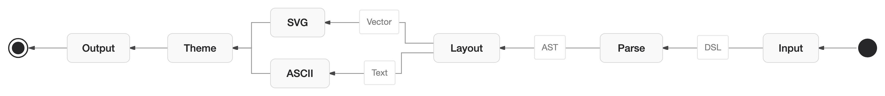

<div align="center">

# zombie-mermaid

**Render Mermaid diagrams as beautiful SVGs or ASCII art**

Ultra-fast, fully themeable, zero DOM dependencies. A maintained fork of [`beautiful-mermaid`](https://github.com/lukilabs/beautiful-mermaid).



[**Live demo →**](https://dfadler.github.io/zombie-mermaid/)

[](https://www.npmjs.com/package/zombie-mermaid)
[](LICENSE)

</div>

---

## Why This Fork Exists

`beautiful-mermaid` is a genuinely good library — see "Why We Built This" below — but upstream development has stalled: as of this writing there are 30 open pull requests, the oldest dating back over half a year, and nothing has merged in months. `zombie-mermaid` is the same codebase, kept moving: upstream fixes get pulled in, PRs stuck in the upstream queue get a home, and releases actually ship.

It's still MIT-licensed, still built on the same foundation, and still credits the original authors below.

## Why We Built This

Diagrams are essential for AI-assisted programming. When you're working with an AI coding assistant, being able to visualize data flows, state machines, and system architecture—directly in your terminal or chat interface—makes complex concepts instantly graspable.

[Mermaid](https://mermaid.js.org/) is the de facto standard for text-based diagrams. It's brilliant. But the default renderer has problems:

- **Aesthetics** — Might be personal preference, but wished they looked more professional
- **Complex theming** — Customizing colors requires wrestling with CSS classes
- **No terminal output** — Can't render to ASCII for CLI tools
- **Heavy dependencies** — Pulls in a lot of code for simple diagrams

We built `beautiful-mermaid` at [Craft](https://craft.do) to power diagrams in [Craft Agents](https://agents.craft.do). It's fast, beautiful, and works everywhere—from rich UIs to plain terminals.

The ASCII rendering engine is based on [mermaid-ascii](https://github.com/AlexanderGrooff/mermaid-ascii) by Alexander Grooff. We ported it from Go to TypeScript and extended it. Thank you Alexander for the excellent foundation! (And inspiration that this was possible.)

## Features

- **6 diagram types** — Flowcharts, State, Sequence, Class, ER, and XY Charts (bar, line, combined)
- **Dual output** — SVG for rich UIs, ASCII/Unicode for terminals
- **Synchronous rendering** — No async, no flash. Works with React `useMemo()`
- **15 built-in themes** — And dead simple to add your own
- **Full Shiki compatibility** — Use any VS Code theme directly
- **Live theme switching** — CSS custom properties, no re-render needed
- **Mono mode** — Beautiful diagrams from just 2 colors
- **Zero DOM dependencies** — Pure TypeScript, works everywhere
- **Ultra-fast** — Renders 100+ diagrams in under 500ms

## Installation

```bash
npm install zombie-mermaid
# or
bun add zombie-mermaid
# or
pnpm add zombie-mermaid
```

## Quick Start

### SVG Output

```typescript
import { renderMermaidSVG } from 'zombie-mermaid'

const svg = renderMermaidSVG(`
  graph TD
    A[Start] --> B{Decision}
    B -->|Yes| C[Action]
    B -->|No| D[End]
`)
```

Rendering is **fully synchronous** — no `await`, no promises. The ELK.js layout engine runs synchronously via a FakeWorker bypass, so you get your SVG string instantly.

Need async? Use `renderMermaidSVGAsync()` — same output, returns a `Promise<string>`.

### ASCII Output

```typescript
import { renderMermaidASCII } from 'zombie-mermaid'

const ascii = renderMermaidASCII(`graph LR; A --> B --> C`)
```

```
┌───┐     ┌───┐     ┌───┐
│   │     │   │     │   │
│ A │────►│ B │────►│ C │
│   │     │   │     │   │
└───┘     └───┘     └───┘
```

Using this from React? See [React Integration](docs/react-integration.md) for a zero-flash `useMemo()` pattern.

---

## CLI

Installing the package also exposes a `zombie-mermaid` binary:

```bash
zombie-mermaid render diagram.mmd --ascii              # Print ASCII/Unicode to terminal
zombie-mermaid render diagram.mmd --svg -o out.svg      # Render to an SVG file
cat diagram.mmd | zombie-mermaid render --ascii         # Read from stdin
zombie-mermaid themes                                   # List built-in theme names
zombie-mermaid --help                                   # Show all options
```

`--theme <name>` applies a built-in theme (from `themes`) to either output mode.

---

## Docs

- [Guides](docs/guides/) — task-oriented walkthroughs: [browsing the samples](docs/guides/samples.md), [choosing a theme](docs/guides/theming.md)
- [Theming](docs/theming.md) — the two-color foundation, enriched mode, built-in themes, custom themes, Shiki compatibility
- [Supported Diagrams](docs/diagrams.md) — syntax for every diagram type, XY chart styling, and ASCII rendering options
- [React Integration](docs/react-integration.md) — zero-flash rendering with `useMemo()`
- [API Reference](docs/api-reference.md) — full function and options reference

More design write-ups and reference material live in [docs/](docs/).

---

## Attribution

The ASCII rendering engine is based on [mermaid-ascii](https://github.com/AlexanderGrooff/mermaid-ascii) by Alexander Grooff. We ported it from Go to TypeScript and extended it with:

- Sequence diagram support
- Class diagram support
- ER diagram support
- Unicode box-drawing characters
- Configurable spacing and padding

Thank you Alexander for the excellent foundation!

---

## License

MIT — see [LICENSE](LICENSE) for details.

<!-- throwaway-test-engage: exercising claude-review-app's engage
     (thread-reply/re-verify) flow end-to-end. Contains a deliberate,
     obvious bug in the example snippet below so the reviewer has a real
     finding to comment on. Safe to ignore/revert. -->

### Strict-mode rendering (example)

```js
function renderDiagram(source, options) {
  if (options.strict === true) {
    return zombieMermaid.render(source, { strict: true })
  }
  return zombieMermaid.render(source)
}
```

---

<div align="center">

Built with care by the team at [Craft](https://craft.do)

</div>
