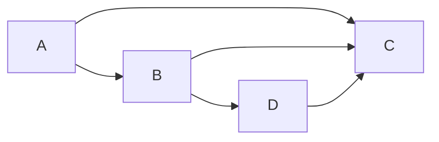
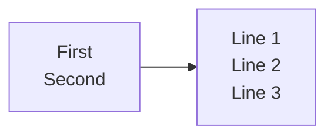
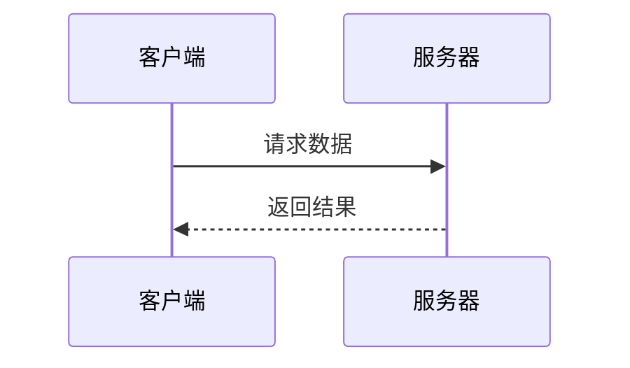
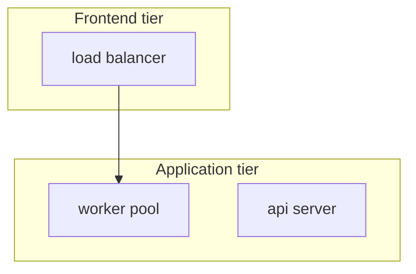
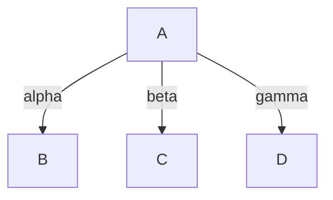
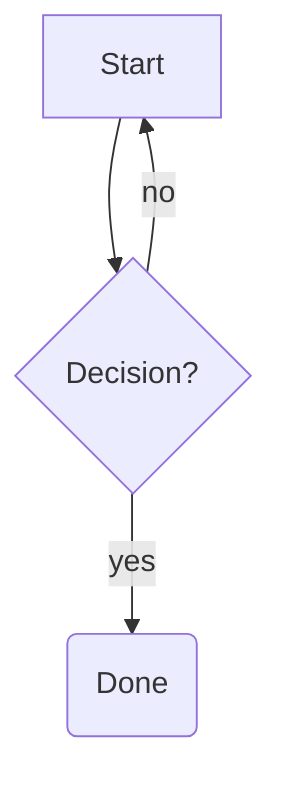
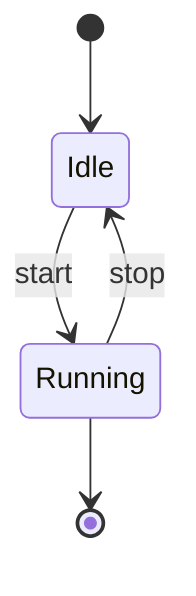
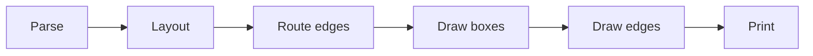

If you render Mermaid in a terminal, you have probably used
[mermaid-ascii](https://github.com/AlexanderGrooff/mermaid-ascii), Alexander
Grooff's Go CLI. zombie-mermaid's ASCII renderer started life as a
TypeScript port of that codebase (see the
[attribution](https://github.com/dfadler/zombie-mermaid#attribution)), so for
plain flowcharts the two produce the same characters. This post is about the
places where they don't, and it's written for people who already have
mermaid-ascii in their toolbox and want to know what switching would actually
change.

The short version: you can run zombie-mermaid without installing anything
permanently,

```bash
npx zombie-mermaid render diagram.mmd --ascii
```

and it is worth doing if you hit any of the cases below. If you don't, there
is less reason to switch than a comparison post might suggest, and the last
section says where mermaid-ascii is still the better tool.

## How this was checked

Every output block below was produced on 2026-09-05 by running the same
`.mmd` file through both tools:

- **mermaid-ascii 1.5.0**, the `Darwin_arm64` release binary (tag `b1b35f6`,
  published 2026-08-11), verified against the release's checksum file.
  The `master` branch had moved past that release by 14 commits at the time
  of writing (tip `aa31760`): sequence-diagram activation, `create`/`destroy`,
  `box` groups, and the extended flowchart arrow patterns from their
  [#81](https://github.com/AlexanderGrooff/mermaid-ascii/issues/81). None of
  those touch the cases in this post.
- **zombie-mermaid 1.8.0**, run from the repository at commit `ede76ba` with
  `pnpm exec tsx src/cli.ts render <file> --ascii`. That is what
  `npx zombie-mermaid render <file> --ascii` runs.

Where an issue number from mermaid-ascii's tracker is cited, the claim is
about what the 1.5.0 binary does today, not about the issue's open/closed
label. Several of their fixed issues are still marked open, and several
features that look blocked on stalled PRs have already shipped through other
commits, so open/closed status is not a reliable signal there. Two examples
of that are in the next section.

## What is the same

Start with what does not differ, because a fair amount doesn't.

### Basic flowcharts are character-for-character identical



Both tools print exactly this (trailing whitespace aside):

```text
┌───┐     ┌───┐     ┌───┐
│   │     │   │     │   │
│ A ├────►│ B ├──┬─►┤ D │
│   │     │   │  │  │   │
└─┬─┘     └─┬─┘  │  └───┘
  │         │    │
  │         │    │
  │         ├────┘
  │         │
  │         ▼
  │       ┌───┐
  │       │   │
  └──────►│ C │
          │   │
          └───┘
```

Same box style, same `-x`/`-y`/`-p` spacing flags with the same defaults,
same edge routing. If your existing diagrams are simple flowcharts, expect
them to look the same.

### Flowchart CJK labels work in both

mermaid-ascii's PR [#49](https://github.com/AlexanderGrooff/mermaid-ascii/pull/49)
("Fix graph diagram CJK/Unicode character rendering") is still open and
conflicting, which makes it look like wide characters are broken in
flowcharts. They aren't, in 1.5.0: the fix landed separately in March 2026
(`ee20c36`, "preserve graph label widths for wide runes"), and the PR was
simply never closed.


Both tools:

```text
┌──────┐     ┌──────────┐     ┌──────┐
│      │     │          │     │      │
│ 开始 ├────►│ 处理数据 ├────►│ 结束 │
│      │     │          │     │      │
└──────┘     └──────────┘     └──────┘
```

Bare CJK node IDs (`开始 --> 结束`, no brackets) also render correctly in
both. zombie-mermaid had its own bug there until 1.7.0
([#328](https://github.com/dfadler/zombie-mermaid/issues/328)).

### Multi-line labels work in both

Likewise PR [#47](https://github.com/AlexanderGrooff/mermaid-ascii/pull/47)
(multi-line labels via `<br/>`) is open and conflicting, but the feature
shipped through `6ab2af2` in March 2026.



mermaid-ascii 1.5.0 puts a blank row between each line:

```text
┌────────┐     ┌────────┐
│        │     │        │
│        │     │ Line 1 │
│ First  │     │        │
│        ├────►│ Line 2 │
│ Second │     │        │
│        │     │ Line 3 │
│        │     │        │
└────────┘     └────────┘
```

zombie-mermaid keeps them adjacent:

```text
┌────────┐     ┌────────┐
│        │     │        │
│        │     │ Line 1 │
│ First  ├────►│ Line 2 │
│ Second │     │ Line 3 │
│        │     │        │
└────────┘     └────────┘
```

That is a spacing preference, not a capability gap.

### Sequence-diagram fragments work in both

Their [#68](https://github.com/AlexanderGrooff/mermaid-ascii/issues/68)
(`alt`/`else`/`opt`/`loop`/`par`/`critical`/`break`/`rect` all failing to
parse) is still open, but 1.5.0 renders every one of those as a labelled
frame. Not a differentiator.

## Where they differ

### Sequence diagrams with wide characters

This is the one to check first if your diagrams contain CJK text.
mermaid-ascii's README lists "Unicode support (emojis, CJK characters, etc.)"
under sequence diagrams, and the characters do come out intact. But the
layout measures them as one column each, and a CJK character occupies two,
so every line that contains one is pushed right.



mermaid-ascii 1.5.0:

```text
┌────────┐     ┌────────┐
│ 客户端 │        │ 服务器 │
└────┬───┘     └────┬───┘
     │              │
     │ 请求数据         │
     ├─────────────►│
     │              │
     │ 返回结果         │
     │◄┈┈┈┈┈┈┈┈┈┈┈┈┈┤
     │              │
```

zombie-mermaid:

```text
┌────────┐    ┌────────┐
│ 客户端 │    │ 服务器 │
└────┬───┘    └────┬───┘
     │             │
     │  请求数据   │
     │─────────────▶
     │             │
     │  返回结果   │
     ◀╌╌╌╌╌╌╌╌╌╌╌╌╌│
     │             │
┌────┴───┐    ┌────┴───┐
│ 客户端 │    │ 服务器 │
└────────┘    └────────┘
```

Measured by display width (East Asian Wide characters counted as two
columns), mermaid-ascii's lines come out at 25, 28, 25, 21, 25, 21, 21, 25,
21, 21 columns; zombie-mermaid's lifeline rows are all 20 and its box rows
all 24. The same thing happens with Japanese participant names and with a
Latin diagram whose message text is CJK. zombie-mermaid had exactly this bug
until 1.7.0 ([#334](https://github.com/dfadler/zombie-mermaid/issues/334));
the fix was to measure text by display width everywhere the sequence
renderer sizes or positions it.

(One stylistic difference is visible above and is not a bug: zombie-mermaid
repeats the participant boxes at the bottom, the way mermaid.js does.)

### Subgraphs containing a node with no edges

Their [#91](https://github.com/AlexanderGrooff/mermaid-ascii/issues/91),
reported against both 1.5.0 and `master`. Two subgraphs, one edge between
them, and one node (`b2`) that nothing connects to.



mermaid-ascii 1.5.0 merges the two frames, overwrites one title with the
other, and draws `worker pool` in the frontend column:

```text
┌───────────────────┬──────────────────┐
│   FrontenApplication tier            │
│                   │                  │
│                   │                  │
│ ┌───────────────┐ │   ┌────────────┐ │
│ │               │ │   │            │ │
│ │ load balancer │ │   │ api server │ │
│ │               │ │   │            │ │
│ └───────┬───────┘ │   └────────────┘ │
│         │         │                  │
├─────────┼─────────┘                  │
│         │                            │
│         │                            │
│         │                            │
│         │                            │
│         │                            │
│         │                            │
│         ▼                            │
│ ┌───────────────┐                    │
│ │               │                    │
│ │  worker pool  │                    │
│ │               │                    │
│ └───────────────┘                    │
│                                      │
└──────────────────────────────────────┘
```

zombie-mermaid:

```text
┌───────────────────┐
│   Frontend tier   │
│                   │
│                   │
│ ┌───────────────┐ │
│ │               │ │
│ │ load balancer │ │
│ │               │ │
│ └───────┬───────┘ │
│         │         │
└─────────┼─────────┘
          │
          │
          │
┌─────────┼────────────────────────────┐
│         │ Application tier           │
│         │                            │
│         ▼                            │
│ ┌───────────────┐     ┌────────────┐ │
│ │               │     │            │ │
│ │  worker pool  │     │ api server │ │
│ │               │     │            │ │
│ └───────────────┘     └────────────┘ │
│                                      │
└──────────────────────────────────────┘
```

### Three labelled edges out of one node, top-down

Their [#70](https://github.com/AlexanderGrooff/mermaid-ascii/issues/70): in
`TB` layout the middle label disappears. The edge is drawn, the label isn't.



mermaid-ascii 1.5.0 (no `beta`):

```text
┌────────┐
│        │
│   A    ├─gamma──┬─┐
│        │        │ │
└────┬───┘        └─┼─────────┐
     │              │         │
     │              │         │
   alpha            │         │
     │              │         │
     ▼              ▼         ▼
┌────────┐        ┌───┐     ┌───┐
│        │        │   │     │   │
│   B    │        │ C │     │ D │
│        │        │   │     │   │
└────────┘        └───┘     └───┘
```

zombie-mermaid keeps all three. `beta` and `gamma` share the horizontal run
out of `A`, which is cramped but complete:

```text
┌───────┐
│       │
│   A   ├─beta──gamma────────┐
│       │        │           │
└───┬───┘        │           │
    │            │           │
  alpha          │           │
    │            │           │
    │            │           │
    ▼            ▼           ▼
┌───────┐      ┌───┐       ┌───┐
│       │      │   │       │   │
│   B   │      │ C │       │ D │
│       │      │   │       │   │
└───────┘      └───┘       └───┘
```

### Node shapes, and labels that aren't IDs

mermaid-ascii's README lists "Shapes other than rectangles" as unsupported,
and their [#46](https://github.com/AlexanderGrooff/mermaid-ascii/issues/46)
tracks the consequence: `B{Decision?}` is parsed as a node whose ID is the
literal string `B{Decision?}`, so a later reference to `B` creates a second
node. Square-bracket labels were fixed; braces and parentheses were not, per
a later comment on that issue, and 1.5.0 behaves the same way.



mermaid-ascii 1.5.0 renders four nodes for a three-node graph, with the
brace and parenthesis syntax printed verbatim:

```text
┌──────────────┐     ┌─────────┐
│              │     │         │
│    Start     │◄no──┤    B    │
│              │     │         │
└───────┬──────┘     └────┬────┘
        │                 │
        │                 │
        │                yes
        │                 │
        ▼                 ▼
┌──────────────┐     ┌─────────┐
│              │     │         │
│ B{Decision?} │     │ C(Done) │
│              │     │         │
└──────────────┘     └─────────┘
```

zombie-mermaid renders three nodes, with the diamond and the rounded box
marked as such:

```text
┌───────────┐
│           │
│   Start   │
│           │
└─────┬─────┘
      ▲
      │
      │
     no
      ▼
◇─────┴─────◇
│           │
│ Decision? │
│           │
◇─────┬─────◇
      │
     yes
      │
      │
      ▼
╭───────────╮
│           │
│    Done   │
│           │
╰───────────╯
```

### Diagram types beyond flowchart, sequence and ER

mermaid-ascii supports graphs/flowcharts, sequence diagrams, and ER
diagrams. Anything else is a hard error:

```text
level=fatal msg="failed to parse graph diagram: unsupported graph type 'stateDiagram-v2'. Supported types: 'graph' or 'flowchart' with an optional direction (TD, TB, BT, LR, RL)"
```

That is their [#61](https://github.com/AlexanderGrooff/mermaid-ascii/issues/61),
still open. `classDiagram` fails the same way. zombie-mermaid renders
`stateDiagram-v2`, `classDiagram`, and `xychart-beta` in ASCII, in addition
to the three both tools share:



```text
●─────────●
│         │
●─────────●
     │
     │
     │
     │
     ▼
╭─────────╮
│         │
│   Idle  │
│         │
╰────┬────╯
     ▲
   start
     │
   stop
     ▼
╭────┴────╮
│         │
│ Running │
│         │
╰────┬────╯
     │
     │
     │
     │
     ▼
╔═════════╗
║         ║
╚═════════╝
```

### Fitting a terminal width

mermaid-ascii has "Prevent rendering more than X characters wide" on its
TODO list, and PR #47 proposed a `-w/--maxWidth` flag that never merged;
1.5.0 rejects `-w` as an unknown flag. zombie-mermaid has `-w`/`--max-width
<n|auto>`: if the output at the requested spacing is wider than the limit,
it retries with compact spacing (`-x 1 -y 1 -p 0`) and tells you on stderr.



`zombie-mermaid render chain.mmd --ascii --max-width 70`:

```text
Note: ASCII output exceeded 70 columns at the requested spacing; applied compact spacing automatically (-x 1 -y 1 -p 0) to fit.
┌─────┐ ┌──────┐ ┌───────────┐ ┌──────────┐ ┌──────────┐ ┌─────┐
│Parse├►│Layout├►│Route edges├►│Draw boxes├►│Draw edges├►│Print│
└─────┘ └──────┘ └───────────┘ └──────────┘ └──────────┘ └─────┘
```

`auto` reads the terminal's width. Be clear about the limit, though: compact
spacing is the only strategy. If the diagram still doesn't fit (this one is
64 columns at its narrowest, so `--max-width 40` cannot succeed), you get the
compact rendering plus a warning, not wrapped labels or a flipped direction.
That is tracked in
[#335](https://github.com/dfadler/zombie-mermaid/issues/335).

### SVG output and themes from the same source

This isn't a comparison so much as a category difference: mermaid-ascii is
an ASCII renderer, and zombie-mermaid is an SVG renderer that also does
ASCII. The same file that produced any of the text above can produce an SVG:

```bash
zombie-mermaid render diagram.mmd --svg -o diagram.svg --theme tokyo-night
zombie-mermaid themes   # lists the built-in themes
```

There's also an MCP server (`zombie-mermaid mcp`) exposing the same render
calls to an agent, and a local web UI (`zombie-mermaid web`), which
mermaid-ascii also has.

## Where mermaid-ascii is better, or just as good

- **ER diagrams.** mermaid-ascii's ER renderer (added in July 2026) draws
  crow's-foot cardinality tokens and gives every relationship its own
  routing lane so labels never collide. For the same two-relationship
  schema, its output is easier to read than zombie-mermaid's:

  ```mermaid
  erDiagram
      CUSTOMER ||--o{ ORDER : places
      ORDER ||--|{ LINE_ITEM : contains
  ```

  mermaid-ascii 1.5.0:

  ```text
  ┌──────────┐                ┌───────┐
  │ CUSTOMER │                │ ORDER │
  └─────┬────┘                └─┬───┬─┘
        └||──────places───────o{┘   │
         ┌}|───────contains───────||┘
  ┌──────┴────┐
  │ LINE_ITEM │
  └───────────┘
  ```

  zombie-mermaid:

  ```text
  ┌──────────┐        ┌───────┐
  │ CUSTOMER │─│────○╟│ ORDER │
  └──────────┘ places └───────┘
                          ┼
        ┌ contains ───────┘
        │
        ╟
  ┌───────────┐
  │ LINE_ITEM │
  └───────────┘
  ```

- **A plain-ASCII charset switch on the CLI.** `mermaid-ascii --ascii`
  swaps box-drawing characters for `+`, `-`, `|` and `>`. zombie-mermaid
  exposes that only through the library (`renderMermaidASCII(src, { useAscii:
true })`); the CLI's `--ascii` flag means "print the terminal rendering",
  not "restrict to 7-bit ASCII".
- **A single static binary.** mermaid-ascii is one file with no runtime.
  `npx zombie-mermaid` needs Node.js and downloads the package on first run.
- **Everything both tools share renders about the same.** Flowcharts,
  labelled edges, `A & B` fan-out, sequence messages, notes, `autonumber`,
  fragments: the defaults match closely enough that a side-by-side is mostly
  a diff of whitespace.

## Trying it

```bash
npx zombie-mermaid render diagram.mmd --ascii
cat diagram.mmd | npx zombie-mermaid render --ascii --max-width auto
```

If a diagram renders worse in zombie-mermaid than in mermaid-ascii, that's a
bug here, and a
[minimal `.mmd` in an issue](https://github.com/dfadler/zombie-mermaid/issues)
is the fastest way to get it fixed. The two ER outputs above are already
that kind of report against ourselves.
