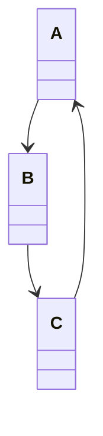
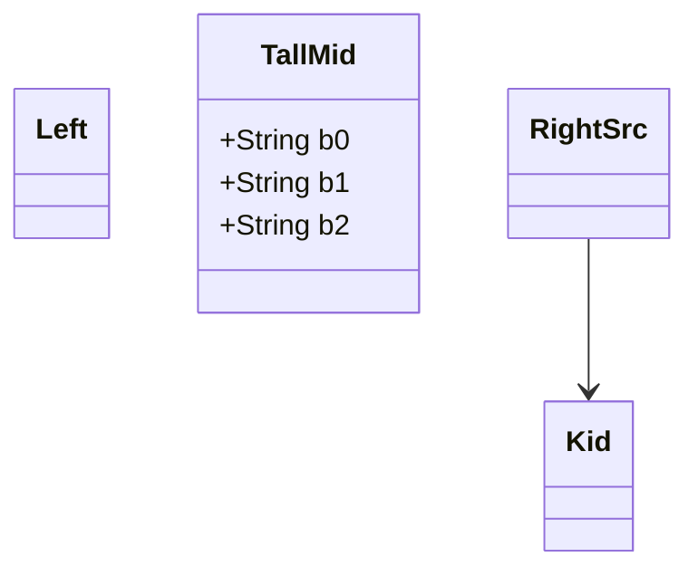

The [last post](/blog/why-i-forked-beautiful-mermaid.html) went up on 2026-09-10.
Before that day was over, a release-readiness audit had already filed
[#953](https://github.com/dfadler/zombie-mermaid/issues/953): five confirmed
ASCII rendering bugs, each written up as an `it.fails(...)` test so it would
document the defect without blocking CI. Both fixes landed within four hours
of each other, the same evening. That part of the story is a clean win. The
more interesting part is what happened next: fixing the fix's own review
turned up a bug the same guard pattern couldn't touch, because the guard had
been patching the output of a layout decision that was wrong from the start.

## Five bugs, one missing check

All five cases in #953 trace back to the same shape of mistake: a rendering
pass computes where to draw a line or a box from the two things it already
knows about — a relationship's two endpoints, a note's own lifeline position
— and never checks whether anything else is already occupying the cells it's
about to write through.

Cases 1 and 2 were in `class-diagram.ts`. A relationship cycle that can't be
linearly leveled (`A --> B --> C --> A`) puts every class in the cycle on the
same row, and the "same level" routing branch computed its detour purely from
the relationship's own two endpoints — `Math.max(fromBY, toBY) + 2`. If a
third, unrelated, taller class happened to sit between those two endpoints on
that row, the detour's horizontal segment drew straight through it, through
plain `setC`, which only bounds-checks the canvas, never occupancy-checks it:

Cases 3 through 5 were the sequence-diagram equivalent, one file over.
`sequence.ts` positions a `Note left of`/`Note right of` box relative to an
already-finalized lifeline layout, then clamps the computed x-position to
`Math.max(0, nx)` — which doesn't reserve room for the note, it just forces
whatever overlap the clamp produces. Separately, the gap between adjacent
lifelines was only ever sized from message-label widths, so a wide note had
no guarantee of a big enough gap regardless of the clamp.

Neither fix invented anything new. `er-diagram.ts` had already solved this
exact class of problem for issue [#350](https://github.com/dfadler/zombie-mermaid/issues/350):
`setCGuarded`/`boxCells`/`regionClear`, a snapshot of occupied cells that
every write gets checked against before it lands. [#957](https://github.com/dfadler/zombie-mermaid/pull/957)
generalized that guard to `class-diagram.ts`, so a mis-routed segment now
degrades to a gap in the line instead of corrupting a box. [#956](https://github.com/dfadler/zombie-mermaid/pull/956)
took the sequence-diagram side further upstream: instead of guarding the
write after the fact, it sizes each actor's lifeline gap to include note
width during layout, the same way message labels already widen gaps — so
there's nothing left to clamp. Both merged the same evening #953 was filed:
#956 at 20:48 UTC, #957 at 23:44 UTC.

## The sixth bug the guard didn't cover

Closing #953 didn't stop anyone from looking at `class-diagram.ts` again.
[#963](https://github.com/dfadler/zombie-mermaid/pull/963), merged nineteen
minutes before #957, fixed a bug that wasn't part of #953 at all: a
different branch of the same file, the one that routes a connector between
two classes on *different* levels. Its "no collision" check tested whether
the source class's own lane column was clear across the row range — it never
checked whether the horizontal jog connecting that column to the target's
column was clear the whole way across. A taller, unrelated sibling sitting
in between got its attribute rows silently overwritten by the jog, same
failure mode as cases 1 and 2, different code path.

Fixing #963 is what surfaced the deeper problem. [#964](https://github.com/dfadler/zombie-mermaid/issues/964),
filed the same review pass, names it plainly: the jog is only that long in
the first place because `class-diagram.ts`'s level-positioning loop packs
each level's classes strictly left-to-right in declaration order, with zero
reference to where any class's parent landed. A level with exactly
one occupant always starts at column 0 — even when its real parent is
sitting far to the right, one level up:

`Kid` is `RightSrc`'s only child, so it's the sole occupant of its level and
renders under `Left` — not under `RightSrc` — forcing the connector to jog
the full width of the canvas to reach it. #963's guard makes that jog safe
to draw. It does nothing about the jog being there at all.

## Why the obvious fix didn't work

#964's own write-up includes something this blog's posts don't always get to
show: a fix that got prototyped, tested, and rejected before the issue was
even filed. The instinct is a barycenter reorder — a standard layered-graph
technique, reorder each level's classes by the average relative position of
their parents. It was tried first. Two things killed it: reordering only
changes relative order *among siblings at the same level*, so it's a no-op
exactly where the repro above breaks (one occupant, nothing to reorder it
against); and diffing all sixteen `classDiagram` samples in the catalog
before/after the reorder produced zero output changes — none of them happen
to hit the pattern it would have fixed. A standard technique, correctly
implemented, that solves a problem this codebase doesn't actually have.

The real fix needs x-coordinate placement, which is the same family
of problem as Sugiyama/Brandes-Köpf layered-graph x-coordinate assignment —
not a small tweak, and one that would shift box positions across every class
diagram with more than one class per level. #964 scoped that as its own
piece of work rather than folding it into a bug-fix PR, staged as design,
then implementation, then a full visual re-verification pass.

## Choosing an algorithm, then shipping the easy half of it

The design stage, [#970](https://github.com/dfadler/zombie-mermaid/issues/970),
landed as a decision doc rather than code: [`docs/decisions/ascii-class-diagram-x-coordinate-assignment-970.md`](https://github.com/dfadler/zombie-mermaid/blob/main/docs/decisions/ascii-class-diagram-x-coordinate-assignment-970.md).
It adopts a block-based priority method — an integer-cell, single-pass
predecessor of full Brandes-Köpf, not the four-alignment-plus-averaging
version. The doc is explicit about why the fuller algorithm was rejected:
averaging four independently collision-free real-valued layouts has no
overlap guarantee, which stops being a cosmetic risk and becomes a
correctness hazard once positions are discrete character cells. Siblings
that share an identical parent set get grouped into one alignment block
rather than aligned independently, because the doc's own simulation showed
the naive per-node version silently degrading back to today's left-to-right
packing on this repo's real `Inheritance (<|--)` sample.

The implementation shipped so far, [#1019](https://github.com/dfadler/zombie-mermaid/pull/1019),
is deliberately just the first stage: the single-parent case from #964's own
repro. A singleton block — no sibling shares its parent set — with exactly
one qualifying parent computes a desired center equal to that parent's
already-placed box center, then a left-to-right compaction pass resolves any
collision against a neighboring block. #964 itself is still open.
Multi-parent convergence and the general collision-resolution case are the
harder half the design doc flagged, and they haven't shipped yet.

There's a sibling case worth naming too: [#992](https://github.com/dfadler/zombie-mermaid/issues/992),
found by direct visual inspection of the `fork-fixes.html` showcase page
rather than an audit or an algorithm review, was a `Note over <single actor>`
box wide enough to spill into the neighboring actor's column — the same
missing-reservation shape as #956's cases 3-5, just for a variant of the
`Note` syntax that fix hadn't covered. [#1013](https://github.com/dfadler/zombie-mermaid/pull/1013)
folded it into the same gap-sizing pass, confirmed in a real terminal via
`scripts/ascii-terminal-capture.sh`, not the browser's HTML approximation of
one.

## What the guard was for

The occupancy-guard pattern from #350 is the right fix for exactly one
question: is this write about to land on top of something else? It answered
that question correctly five times in one evening, and a sixth time a few
hours later. What it can't tell you is whether the position it's guarding
was ever a good one to write to in the first place — that's a layout
question, not a collision question, and #964 is what happens when a bug
report finally asks it directly instead of asking why the write collided.
The guard stays; `class-diagram.ts` needed it regardless of where any box
ends up. It's just no longer the whole story for this file, and the decision
doc and its still-open follow-up are where the rest of it lives now.
