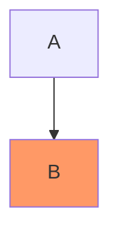
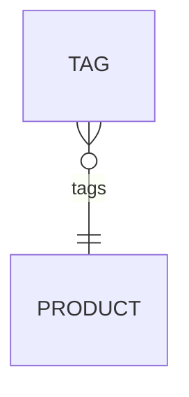
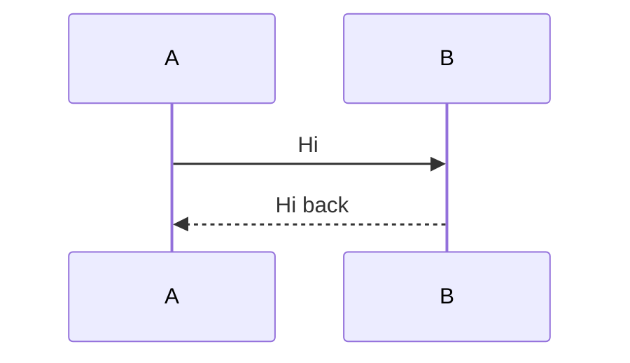

[#630](https://github.com/dfadler/zombie-mermaid/issues/630) asked whether a
blog post comparing zombie-mermaid to
[`beautiful-mermaid`](https://github.com/lukilabs/beautiful-mermaid) — the
project this repo forked from — was worth writing, and set a condition
first: don't write it unless there's a real, demonstrable difference, not
two READMEs making similar claims. This is that check.

What follows isn't a rendered side-by-side. Building and running
`beautiful-mermaid`'s own code wasn't something this check did; the `upstream`
git remote this repo already carries — the same one
[`.github/workflows/upstream-check.yml`](https://github.com/dfadler/zombie-mermaid/blob/main/.github/workflows/upstream-check.yml)
fetches from weekly to watch for new commits — was enough to pull its current
source and read it directly. For the three bugs below, that's actually a
stronger form of proof than a screenshot: each one is a regex or a
normalization step that provably can't match certain input, which is true
regardless of what render pipeline sits on top of it. No screenshot needed to
show a `$`-anchored pattern rejecting a trailing semicolon.

## How current is "current"

`git merge-base upstream/main main` returns `2ac8bbb`
("Merge pull request #106 from lukilabs/fix/editor-link-script-regex",
2026-05-06) — which is also `upstream/main`'s own tip as of this fetch. In
other words, that merge-base isn't just where the fork branched off; it's
where upstream still is. Nothing has landed there since. So every line of
upstream source quoted below is upstream's current behavior as of
2026-09-08, not a snapshot from whenever the fork happened.

The numbers around that:

- **Upstream:** last push 2026-05-06, `package.json` still at `1.1.3`, 84
  open issues, 37 open pull requests, the oldest dated 2026-01-29 — over
  seven months old.
- **This fork:** 1,343 commits past that merge-base, 10 tagged releases in
  the 12 days from `v1.2.0` (2026-08-27) to `2.2.1` (2026-09-08), currently
  at `2.2.1`.

None of that says anything about code quality on its own — a repo can ship
often and still ship bugs. The three cases below are about whether specific,
previously-identified defects are still there.

## Bug 1: a trailing semicolon on `class` creates a stray node

Mermaid tolerates an optional trailing `;` on most statements. Upstream's
class-assignment matcher doesn't allow for it:



Upstream's current `src/parser.ts` (`2ac8bbb`):

```ts
const classAssignMatch = line.match(/^class\s+([\w,-]+)\s+(\w+)$/)
```

The `$` anchors immediately after `(\w+)`, so `class B highlight;` doesn't
match at all. The line falls through into node-parsing instead, and the
diagram gains a fourth node literally labeled `class` rather than styling
`B`. This fork's fix
([#53](https://github.com/dfadler/zombie-mermaid/pull/53), documented in
[the migration guide](https://github.com/dfadler/zombie-mermaid/blob/main/docs/migrating-from-beautiful-mermaid.md#classdef--class-styling))
allows the semicolon explicitly, in
[`packages/core/src/style-directives.ts`](https://github.com/dfadler/zombie-mermaid/blob/main/packages/core/src/style-directives.ts):

```ts
const match = line.match(/^class\s+([\w,-]+)\s+([\w-]+)\s*;?\s*$/)
```

## Bug 2: the left-side "zero or more" ER marker gets dropped

ER diagram cardinality has a left-hand and a right-hand notation that are
mirror images of each other — `}o` on the left means the same "zero or more"
that `o{` means on the right. Upstream's `src/er/parser.ts` normalizes both
sides through one function by sorting their characters:

```ts
function parseCardinality(str: string): Cardinality | null {
  const sorted = str.split('').sort().join('')
  if (sorted === '||') return 'one'
  if (sorted === 'o|') return 'zero-one'
  if (sorted === '|}' || sorted === '{|') return 'many'
  if (sorted === '{o' || sorted === 'o{') return 'zero-many'
  return null
}
```

Sort the two characters of `}o` by char code (`o` is 111, `}` is 125) and
you get `o}` — which matches none of the four branches, since the
zero-many check only recognizes `{o`/`o{`, not `o}`. So:



parses to a `null` cardinality on the `TAG` side and the marker is silently
absent from output. This fork's fix
([#51](https://github.com/dfadler/zombie-mermaid/pull/51)) stopped
normalizing by sort order and matches each side's four literal patterns
directly, in
[`packages/mermaid-parser/src/er/parser.ts`](https://github.com/dfadler/zombie-mermaid/blob/main/packages/mermaid-parser/src/er/parser.ts):

```ts
function parseLeftCardinality(str: string): Cardinality | null {
  if (str === '||') return 'one'
  if (str === '|o') return 'zero-one'
  if (str === '}|') return 'many'
  if (str === '}o') return 'zero-many'
  return null
}
```

with the accompanying comment noting exactly why: "sorting `}o` and `o{` to
the same key conflates 'zero or more' with malformed input."

## Bug 3: a semicolon-separated diagram body parses as empty

`parseMermaid` in upstream's `src/parser.ts` splits the whole input on
newlines before anything else happens:

```ts
export function parseMermaid(text: string): MermaidGraph {
  const lines = text.split('\n').map(l => l.trim()).filter(l => l.length > 0 && !l.startsWith('%%'))
```

That's fine for a multi-line diagram. It isn't fine for a Mermaid diagram
written on one line with `;` as the separator — valid, longstanding Mermaid
syntax:



Header detection routes this to the sequence parser correctly (it does
split on `;` for that one check), but the body only ever gets split on
`\n`, so the sequence parser receives one giant unsplit line as its content
and produces zero messages. The same single-newline split feeds the class,
ER, and `xychart-beta` parsers too. This fork's fix
([#204](https://github.com/dfadler/zombie-mermaid/pull/204)) replaced the
scattered per-parser splitting with one statement-splitting helper shared
by every entry point, so `;` and `\n` are both honored everywhere a
diagram's grammar allows a statement separator.

## What this does and doesn't establish

This is three bugs, chosen because they were already itemized with commit
references in
[the migration guide](https://github.com/dfadler/zombie-mermaid/blob/main/docs/migrating-from-beautiful-mermaid.md) —
not an exhaustive re-audit of both codebases, and not a claim that upstream
has no fixes of its own or that these three are the only ones still open
there. It's also a snapshot: upstream could merge a fix for any of these
tomorrow, and the check that would need re-running is the same one this
post just described — pull `upstream/main` and read the file.

It also isn't a claim about which project renders diagrams faster, or has a
nicer default theme, or is easier to embed. `beautiful-mermaid` still is
what the README already says it is: a genuinely good, fast, zero-DOM-dependency
renderer. What this post checks is narrower — whether three specific,
previously-reported parsing defects are still reachable in the exact
upstream tree this fork branched from, four months after that tree stopped
moving. For those three, they are.

If you maintain a fork of something, the check itself is worth stealing
even without publishing a post: `git remote add upstream <url>`, `git
fetch`, and read the file instead of trusting a README's account of what
changed.
