[#630](https://github.com/dfadler/zombie-mermaid/issues/630) asked whether a
blog post comparing zombie-mermaid to
[`beautiful-mermaid`](https://github.com/lukilabs/beautiful-mermaid) — the
project this repo forked from — was worth writing, and set a condition
first: don't write it unless there's a real, demonstrable difference, not
two READMEs making similar claims. This is that check.

What follows isn't a rendered side-by-side. Building and running
`beautiful-mermaid`'s own code wasn't something this check did; the `upstream`
git remote this repo already carries — the same one
[`.github/workflows/upstream-check.yml`](https://github.com/dfadler/zombie-mermaid/blob/main/.github/workflows/upstream-check.yml)
fetches from weekly to watch for new commits — was enough to pull its current
source and read it directly. For the eleven bugs below, that's actually a
stronger form of proof than a screenshot: each one is a regex, a missing type
field, or a hardcoded constant that provably can't handle certain input or
carry certain data through, which is true regardless of what render pipeline
sits on top of it. No screenshot needed to show a `$`-anchored pattern
rejecting a trailing semicolon.

## How current is "current"

`git merge-base upstream/main main` returns `2ac8bbb`
("Merge pull request #106 from lukilabs/fix/editor-link-script-regex",
2026-05-06) — which is also `upstream/main`'s own tip as of this fetch. In
other words, that merge-base isn't just where the fork branched off; it's
where upstream still is. Nothing has landed there since. So every line of
upstream source quoted below is upstream's current behavior as of
2026-09-08, not a snapshot from whenever the fork happened.

The numbers around that:

- **Upstream:** last push 2026-05-06, `package.json` still at `1.1.3`, 84
  open issues, 37 open pull requests, the oldest dated 2026-01-29 — over
  seven months old.
- **This fork:** 1,343 commits past that merge-base, 10 tagged releases in
  the 12 days from `v1.2.0` (2026-08-27) to `2.2.1` (2026-09-08), currently
  at `2.2.1`.

None of that says anything about code quality on its own — a repo can ship
often and still ship bugs. The eleven cases below are about whether specific,
previously-identified defects are still there.

## Bug 1: a trailing semicolon on `class` creates a stray node

Mermaid tolerates an optional trailing `;` on most statements. Upstream's
class-assignment matcher doesn't allow for it:

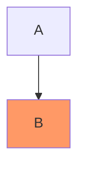

Upstream's current `src/parser.ts` (`2ac8bbb`):

```ts
const classAssignMatch = line.match(/^class\s+([\w,-]+)\s+(\w+)$/)
```

The `$` anchors immediately after `(\w+)`, so `class B highlight;` doesn't
match at all. The line falls through into node-parsing instead, and the
diagram gains a fourth node literally labeled `class` rather than styling
`B`. This fork's fix
([#53](https://github.com/dfadler/zombie-mermaid/pull/53), documented in
[the migration guide](https://github.com/dfadler/zombie-mermaid/blob/main/docs/migrating-from-beautiful-mermaid.md#classdef--class-styling))
allows the semicolon explicitly, in
[`packages/core/src/style-directives.ts`](https://github.com/dfadler/zombie-mermaid/blob/main/packages/core/src/style-directives.ts):

```ts
const match = line.match(/^class\s+([\w,-]+)\s+([\w-]+)\s*;?\s*$/)
```

## Bug 2: the left-side "zero or more" ER marker gets dropped

ER diagram cardinality has a left-hand and a right-hand notation that are
mirror images of each other — `}o` on the left means the same "zero or more"
that `o{` means on the right. Upstream's `src/er/parser.ts` normalizes both
sides through one function by sorting their characters:

```ts
function parseCardinality(str: string): Cardinality | null {
  const sorted = str.split('').sort().join('')
  if (sorted === '||') return 'one'
  if (sorted === 'o|') return 'zero-one'
  if (sorted === '|}' || sorted === '{|') return 'many'
  if (sorted === '{o' || sorted === 'o{') return 'zero-many'
  return null
}
```

Sort the two characters of `}o` by char code (`o` is 111, `}` is 125) and
you get `o}` — which matches none of the four branches, since the
zero-many check only recognizes `{o`/`o{`, not `o}`. So:

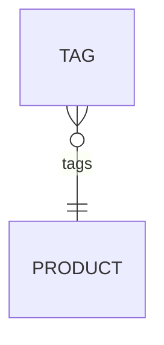

parses to a `null` cardinality on the `TAG` side and the marker is silently
absent from output. This fork's fix
([#51](https://github.com/dfadler/zombie-mermaid/pull/51)) stopped
normalizing by sort order and matches each side's four literal patterns
directly, in
[`packages/mermaid-parser/src/er/parser.ts`](https://github.com/dfadler/zombie-mermaid/blob/main/packages/mermaid-parser/src/er/parser.ts):

```ts
function parseLeftCardinality(str: string): Cardinality | null {
  if (str === '||') return 'one'
  if (str === '|o') return 'zero-one'
  if (str === '}|') return 'many'
  if (str === '}o') return 'zero-many'
  return null
}
```

with the accompanying comment noting exactly why: "sorting `}o` and `o{` to
the same key conflates 'zero or more' with malformed input."

## Bug 3: a semicolon-separated diagram body parses as empty

`parseMermaid` in upstream's `src/parser.ts` splits the whole input on
newlines before anything else happens:

```ts
export function parseMermaid(text: string): MermaidGraph {
  const lines = text.split('\n').map(l => l.trim()).filter(l => l.length > 0 && !l.startsWith('%%'))
```

That's fine for a multi-line diagram. It isn't fine for a Mermaid diagram
written on one line with `;` as the separator — valid, longstanding Mermaid
syntax:

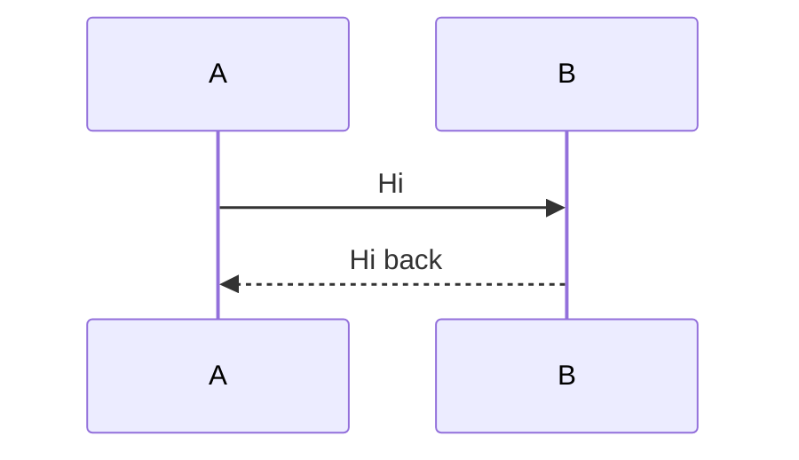

Header detection routes this to the sequence parser correctly (it does
split on `;` for that one check), but the body only ever gets split on
`\n`, so the sequence parser receives one giant unsplit line as its content
and produces zero messages. The same single-newline split feeds the class,
ER, and `xychart-beta` parsers too. This fork's fix
([#204](https://github.com/dfadler/zombie-mermaid/pull/204)) replaced the
scattered per-parser splitting with one statement-splitting helper shared
by every entry point, so `;` and `\n` are both honored everywhere a
diagram's grammar allows a statement separator.

## Bug 4: `:::className` before the shape brackets drops the label

Mermaid's class shorthand can appear either before or after a node's shape
delimiters — `A[External User]:::external` and `A:::external[External User]`
are both valid and mean the same thing. Upstream only handles the first
order:

```mermaid
flowchart TD
  A:::external[External User] --> B
```

Upstream's current `src/parser.ts` runs shape-pattern matching against the
raw, unmodified line:

```ts
function consumeNode(
  text: string,
  graph: MermaidGraph,
  subgraphStack: MermaidSubgraph[]
): ConsumedNode | null {
  let id: string | null = null
  let remaining: string = text

  // Try each node pattern (shape-qualified)
  for (const { regex, shape } of NODE_PATTERNS) {
    const match = text.match(regex)
```

Every entry in `NODE_PATTERNS` is anchored so the id must sit immediately
before its delimiter (`^([\w-]+)\[...\]` and its equivalents for the other
bracket shapes). With a `:::external` token wedged in between, none of them
match, so the loop falls through to `BARE_NODE_REGEX`, which only captures
the bare id `A`. `[External User]` is never consumed as a label — it's left
dangling as unparsed trailing text, and the diagram renders node `A` with no
label at all.

This fork's fix ([#77](https://github.com/dfadler/zombie-mermaid/pull/77))
strips the pre-bracket shorthand before shape matching runs, in
[`src/parser.ts`](https://github.com/dfadler/zombie-mermaid/blob/main/src/parser.ts):

```ts
const PRE_CLASS_SHORTHAND_REGEX = /^([\w\p{L}-]+):::([\w][\w-]*)/u
```

```ts
// Check for ::: class shorthand appearing BEFORE the shape brackets
// (e.g. A:::external[Label]). Strip it out so shape-pattern matching
// below still sees the id directly adjacent to its brackets.
let preClassName: string | undefined
const preClassMatch = remaining.match(PRE_CLASS_SHORTHAND_REGEX)
if (preClassMatch) {
  preClassName = preClassMatch[2]!
  remaining = preClassMatch[1]! + remaining.slice(preClassMatch[0].length)
}
```

## Bug 5: a custom class never reaches the SVG `class` attribute

`classDef`/`class` styling in upstream resolves fine as far as the inline
`fill`/`stroke` on the node — but the class name itself never makes it into
the rendered SVG:

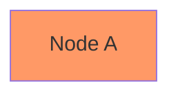

Upstream's `PositionedNode` type, in `src/types.ts`, carries an
`inlineStyle` record but has no field for the class name at all:

```ts
export interface PositionedNode {
  id: string
  label: string
  shape: NodeShape
  x: number
  y: number
  width: number
  height: number
  /** Inline styles resolved from classDef + explicit `style` statements — override theme defaults */
  inlineStyle?: Record<string, string>
}
```

With nowhere to carry it through layout, `renderNode` in `src/renderer.ts`
has nothing to emit but the literal string `"node"`:

```
`<g class="node" data-id="${escapeAttr(node.id)}" data-label="${escapeAttr(node.label)}" data-shape="${node.shape}">`
```

The node's fill still turns orange — that path goes through `inlineStyle`
directly and doesn't need the class name — but any external stylesheet meant
to target `.highlight` (the actual point of naming a class) has no
`class="highlight"` anywhere in the output to select.

This fork's fix ([#75](https://github.com/dfadler/zombie-mermaid/pull/75))
adds the field and emits it, allowlist-sanitized, in
[`packages/svg-renderer/src/renderer.ts`](https://github.com/dfadler/zombie-mermaid/blob/main/packages/svg-renderer/src/renderer.ts):

```ts
const safeClassName = sanitizeClassName(node.className)
const classAttr = safeClassName ? `node ${safeClassName}` : 'node'
```

with `sanitizeClassName` — an allowlist against a valid CSS identifier —
now living in
[`packages/core/src/style-directives.ts`](https://github.com/dfadler/zombie-mermaid/blob/main/packages/core/src/style-directives.ts).

## Bug 6: `font-family` is parsed but never rendered

`style`/`classDef` accept arbitrary CSS-like `key:value` pairs, and
upstream's generic prop parser happily captures whatever key appears:

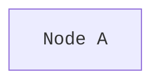

```ts
function parseStyleProps(propsStr: string): Record<string, string> {
  const cleaned = propsStr.replace(/;\s*$/, '')
  const props: Record<string, string> = {}
  for (const pair of cleaned.split(',')) {
    const colonIdx = pair.indexOf(':')
    if (colonIdx > 0) {
      const key = pair.slice(0, colonIdx).trim()
      const val = pair.slice(colonIdx + 1).trim()
      if (key && val) {
        props[key] = val
      }
    }
  }
  return props
}
```

So `font-family: monospace` does land in `node.inlineStyle`. But
`renderNodeLabel`, in upstream's current `src/renderer.ts`, only ever reads
`inlineStyle?.color` out of that record:

```ts
function renderNodeLabel(node: PositionedNode, font: string): string {
  const cx = node.x + node.width / 2
  const cy = node.y + node.height / 2
  const textColor = escapeAttr(node.inlineStyle?.color ?? 'var(--_text)')

  return renderMultilineText(
    node.label,
    cx,
    cy,
    FONT_SIZES.nodeLabel,
    `text-anchor="middle" font-size="${FONT_SIZES.nodeLabel}" font-weight="${FONT_WEIGHTS.nodeLabel}" fill="${textColor}"`,
  )
}
```

Nothing else in the function looks at `inlineStyle['font-family']`, so the
value is parsed, stored on the node, and then discarded — the label renders
in whatever font the theme's global stylesheet rule sets, regardless of the
per-node override that was supposedly requested.

This fork's fix ([#78](https://github.com/dfadler/zombie-mermaid/pull/78))
reads it back out and emits it as an inline `style` attribute — which wins
the cascade over the theme's global rule — in
[`packages/svg-renderer/src/renderer.ts`](https://github.com/dfadler/zombie-mermaid/blob/main/packages/svg-renderer/src/renderer.ts):

```ts
const fontFamily = node.inlineStyle?.['font-family']
if (fontFamily) {
  attrs += ` style="font-family: ${escapeAttr(fontFamily)};"`
}
```

## Bug 7: brackets inside quoted labels, and no-space arrows, both corrupt the graph

Two independent tokenizer bugs share one root cause: upstream's flowchart
lexer is neither quote-aware nor arrow-aware.

First, a literal `[`/`]` inside a quoted label:

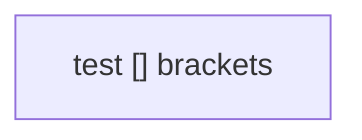

Upstream's shape patterns use a lazy `.+?` that stops at the first closing
delimiter it finds, quoted or not:

```ts
{ regex: /^([\w-]+)\[(.+?)\]/,         shape: 'rectangle' },     // A[text]
```

`A["test [] brackets"]` stops at the `]` that lives inside the quotes, so
the label becomes `"test [` and everything after it is left dangling as
unparsed text.

Second, an arrow with no surrounding whitespace:

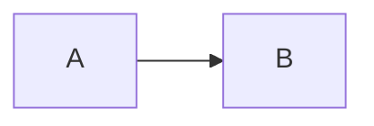

The bare-id lexer is unbounded on hyphens:

```ts
const BARE_NODE_REGEX = /^([\w-]+)/
```

which greedily consumes the arrow's own leading dashes, turning `A-->B`
into a bare node literally named `A--` with `B` stranded as unparsed
trailing text — the edge itself is never parsed at all.

This fork's fix ([#80](https://github.com/dfadler/zombie-mermaid/pull/80))
made every shape pattern quote-aware and constrained the bare-id pattern to
only allow a hyphen between word characters, in
[`src/parser.ts`](https://github.com/dfadler/zombie-mermaid/blob/main/src/parser.ts):

```ts
{ regex: /^([\w\p{L}-]+)\[((?:"[^"]*"|(?!\]).)+)\]/u, shape: 'rectangle' }, // A[text]
```

```ts
const BARE_NODE_REGEX = /^([\w\p{L}]+(?:-[\w\p{L}]+)*)/u
```

## Bug 8: the SVG start-arrow marker points the wrong way

A bidirectional or start-pointing edge (`A <--> B`, `A <-- B`) needs an
arrowhead marker at the _start_ of the line, pointing back out of the
source node. SVG has `orient="auto-start-reverse"` for exactly this — it
flips a `marker-start` 180° automatically. Upstream applies that flip and
also pre-reverses the polygon's own points, which cancels it out:

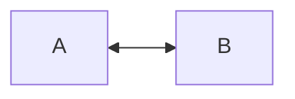

```
// Reverse arrow (marker-start) — refX=1 so it sits at the line start with slight offset, auto-start-reverse flips it
`\n  <marker id="arrowhead-start" markerWidth="${w}" markerHeight="${h}" refX="1" refY="${h / 2}" orient="auto-start-reverse">` +
`\n    <polygon points="${w} 0, 0 ${h / 2}, ${w} ${h}" ${arrowStyle} />` +
`\n  </marker>`
```

Compare that `points="${w} 0, 0 ${h / 2}, ${w} ${h}"` polygon to the forward
marker's `points="0 0, ${w} ${h / 2}, 0 ${h}"` defined a few lines above it
in the same file — it's already the mirror image, before
`auto-start-reverse` mirrors it a second time. The double reversal points
the resulting arrowhead into the line instead of away from it; some SVG
renderers (librsvg, Inkscape) go further and treat the resulting
degenerate, self-overlapping polygon as invisible rather than merely
backwards.

This fork's fix ([#50](https://github.com/dfadler/zombie-mermaid/pull/50))
shares one un-reversed polygon between both markers and lets `orient` alone
do the flipping, in
[`packages/svg-renderer/src/renderer.ts`](https://github.com/dfadler/zombie-mermaid/blob/main/packages/svg-renderer/src/renderer.ts):

```ts
function arrowMarkerPair(color: string, idSuffix: string): string {
  const w = ARROW_HEAD.width
  const h = ARROW_HEAD.height
  const refX = w - 1
  const style = `fill="${color}" stroke="${color}" stroke-width="0.75" stroke-linejoin="round"`
  const polygon = `<polygon points="0 0, ${w} ${h / 2}, 0 ${h}" ${style} />`
  const marker = (id: string, orient: string) =>
    `  <marker id="${id}" markerWidth="${w}" markerHeight="${h}" refX="${refX}" refY="${h / 2}" orient="${orient}">` +
    `\n    ${polygon}` +
    `\n  </marker>`
  return (
    marker(`arrowhead${idSuffix}`, 'auto') +
    '\n' +
    marker(`arrowhead-start${idSuffix}`, 'auto-start-reverse')
  )
}
```

## Bug 9: the ER `direction` directive is parsed nowhere, so layout can't apply it

`direction TB`/`LR`/`BT`/`RL` is a valid statement in an ER diagram, same as
in a flowchart. Upstream's ER layout hardcodes its axis regardless:

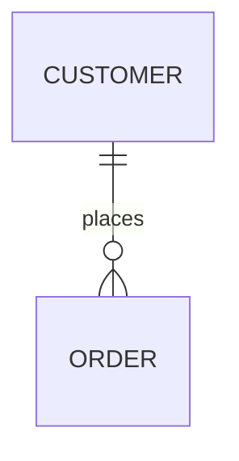

Upstream's current `src/er/parser.ts` has no `direction`-matching branch
anywhere in its statement loop — the line is silently skipped, not even
stored on the diagram — and `src/er/layout.ts` builds the ELK graph with a
fixed axis:

```ts
'elk.direction': 'RIGHT',
```

So a `direction TB` in the source has nothing downstream to act on: there's
no field to parse it into, and the one place layout direction gets set
doesn't consult anything diagram-specific.

This fork's fix (part of
[#81](https://github.com/dfadler/zombie-mermaid/pull/81)) parses the
directive and threads it through to layout, in
[`packages/mermaid-parser/src/er/parser.ts`](https://github.com/dfadler/zombie-mermaid/blob/main/packages/mermaid-parser/src/er/parser.ts):

```ts
const dirMatch = line.match(/^direction\s+(TD|TB|LR|BT|RL)\s*$/i)
if (dirMatch) {
  diagram.direction = toDirection(dirMatch[1]!)
  continue
}
```

and
[`packages/svg-renderer/src/er/layout.ts`](https://github.com/dfadler/zombie-mermaid/blob/main/packages/svg-renderer/src/er/layout.ts):

```ts
direction: directionToElk(diagram.direction, ELK_DIRECTION_FALLBACK.er),
```

## Bug 10: wide characters break ASCII box alignment

The ASCII/Unicode renderer sizes boxes by counting characters, not terminal
columns. A CJK, kana, hangul, fullwidth-form, or emoji character occupies
two columns in a real monospace terminal but counts as one JS string
character:

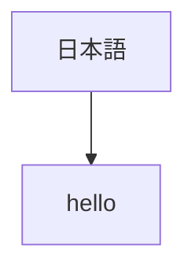

Upstream's box-dimension calculation, in `src/ascii/shapes/rectangle.ts`,
measures with `.length`:

```ts
const maxLineWidth = Math.max(...lines.map((l) => l.length), 0)
```

`"日本語".length` is `3`, but the label needs 6 terminal columns to draw.
The box gets sized for 3, the three wide glyphs get written into it, and
the box's own right border ends up three columns too far to the left of
where the text actually stops rendering — the border no longer lines up
with anything else in the diagram.

This fork's fix ([#94](https://github.com/dfadler/zombie-mermaid/pull/94)
for flowchart/state labels and titles,
[#203](https://github.com/dfadler/zombie-mermaid/pull/203) for class/ER
multi-compartment boxes) added a shared display-width helper and switched
every box-sizing call site to it, in
[`src/ascii/display-width.ts`](https://github.com/dfadler/zombie-mermaid/blob/main/src/ascii/display-width.ts):

```ts
export function displayWidth(text: string): number {
  let width = 0
  for (const ch of text) width += charDisplayWidth(ch)
  return width
}
```

used in
[`src/ascii/shapes/rectangle.ts`](https://github.com/dfadler/zombie-mermaid/blob/main/src/ascii/shapes/rectangle.ts):

```ts
const maxLineWidth = Math.max(...lines.map((l) => displayWidth(l)), 0)
```

## Bug 11: ASCII flowcharts drop `o`/`x` edges, mishandle subgraph-id edges, and print literal tags

Three separate defects in the ASCII conversion path, all still reachable in
upstream's current source.

**`o`/`x` arrow endpoints aren't recognized at all.** `--o`, `--x`, `o--`,
`x--`, and their doubled forms are valid Mermaid edge syntax (circle/cross
terminators), but upstream's arrow regex only knows about `>`:

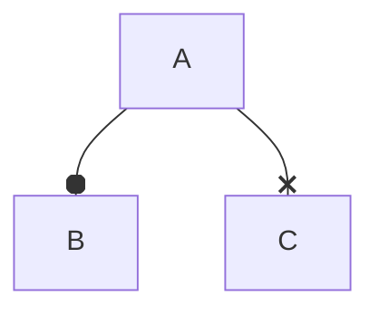

```ts
const ARROW_REGEX = /^(<)?(-->|-.->|==>|---|-\.-|===)(?:\|([^|]*)\|)?/
```

Neither `--o` nor `--x` matches any alternative in that pattern, so
`parseEdgeLine` falls through to the text-embedded-label fallback, which
also doesn't match — the edge, and the node it points to, are silently
dropped from the graph entirely.

**An edge that targets a subgraph id directly produces two disconnected
phantom boxes.** Upstream's `src/ascii/converter.ts` builds one `AsciiNode`
per parser-registered id, with no awareness that some of those ids belong
to subgraphs rather than real nodes:

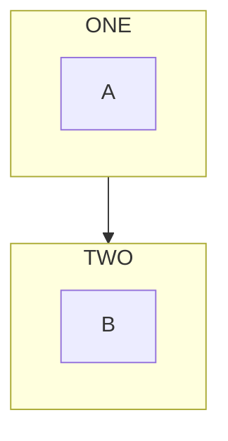

```ts
for (const [id, mNode] of parsed.nodes) {
  const asciiNode: AsciiNode = {
    name: id,
    displayLabel: mNode.label,
    ...
```

```ts
for (const mEdge of parsed.edges) {
  const from = nodeMap.get(mEdge.source)
  const to = nodeMap.get(mEdge.target)
```

There's no branch anywhere in this function that checks whether
`mEdge.source`/`mEdge.target` is a subgraph id rather than a node id, so
`ONE`/`TWO` each get rendered as their own empty box, disconnected from the
actual subgraph frames and from each other.

**Inline formatting tags render as literal text.** `<br/>` is normalized
elsewhere in upstream's parser, but `<b>`, `<i>`, `<em>`, and `<strong>` are
not:

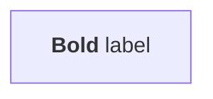

The label above is copied straight into `displayLabel: mNode.label` (shown
in the node-building loop quoted above) with no tag-stripping step, so the
ASCII box literally contains the text `<b>Bold</b> label`.

This fork's fix ([#91](https://github.com/dfadler/zombie-mermaid/pull/91))
addressed all three: it extended the arrow regex to recognize `o`/`x`
terminators, added subgraph-id resolution that redirects such an edge to a
real member node at the subgraph's boundary, and strips formatting tags
before handing labels to the ASCII canvas — in
[`src/parser.ts`](https://github.com/dfadler/zombie-mermaid/blob/main/src/parser.ts)
and
[`src/ascii/converter.ts`](https://github.com/dfadler/zombie-mermaid/blob/main/src/ascii/converter.ts):

```ts
const ARROW_REGEX = /^(<|o|x)?(-{2,}|={2,}|-\.+-|~{3,})(>|o|x)?(?:\|([^|]*)\|)?/
```

```ts
displayLabel: stripFormattingTags(mNode.label),
```

## What this does and doesn't establish

This is eleven bugs, chosen from the nine fix categories itemized with
commit references in
[the migration guide](https://github.com/dfadler/zombie-mermaid/blob/main/docs/migrating-from-beautiful-mermaid.md) —
not an exhaustive re-audit of both codebases, and not a claim that upstream
has no fixes of its own or that these eleven are the only defects still
open there. Two things were deliberately left out:

- **Edge bundling drawn through unrelated nodes** ([#217](https://github.com/dfadler/zombie-mermaid/pull/217))
  isn't comparable to upstream at all — `mergeEdges` is a feature this fork
  added, and the migration guide itself says upstream has no equivalent
  option to check against.
- **Nested subgraph direction and cross-boundary edge routing**
  ([#93](https://github.com/dfadler/zombie-mermaid/pull/93)), and two of
  the six `classDef`/`class` sub-bugs (unreadable text on a custom fill,
  [#76](https://github.com/dfadler/zombie-mermaid/pull/76), and
  `classDef default` not applying to every node,
  [#206](https://github.com/dfadler/zombie-mermaid/pull/206)) weren't
  checked for this post. They're plausibly still present — nothing about
  the merge-base having stayed still since 2026-05-06 suggests otherwise —
  but "plausible" isn't the bar this post holds everything else to, so
  they're left out rather than asserted without having read the code.

It's also a snapshot: upstream could merge a fix for any of these tomorrow,
and the check that would need re-running is the same one this post just
described — pull `upstream/main` and read the file.

It also isn't a claim about which project renders diagrams faster, or has a
nicer default theme, or is easier to embed. `beautiful-mermaid` still is
what the README already says it is: a genuinely good, fast,
zero-DOM-dependency renderer. What this post checks is narrower — whether
eleven specific, previously-reported parsing and rendering defects are
still reachable in the exact upstream tree this fork branched from, four
months after that tree stopped moving. For those eleven, they are.

If you maintain a fork of something, the check itself is worth stealing
even without publishing a post: `git remote add upstream <url>`, `git
fetch`, and read the file instead of trusting a README's account of what
changed.
