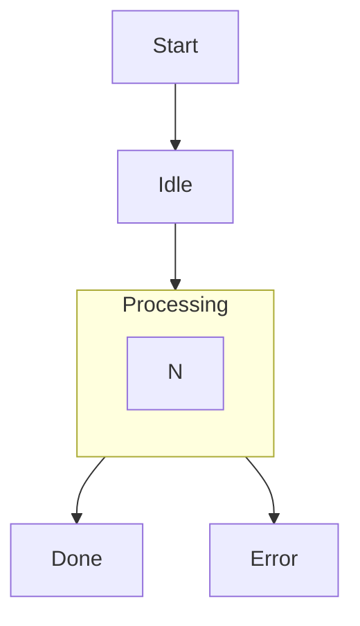

# Scoping: consistent cluster-boundary edge exits in the ASCII renderer

Status: **scoping note, not a decision.** Written for
[#1135](https://github.com/dfadler/zombie-mermaid/issues/1135), which
carries the investigation this doc summarizes (originally posted as an
issue comment). No code under `packages/ascii-renderer/src/**` was changed
to produce this — findings below are grounded in reading the current
implementation and comparing it against real mermaid's SVG output, not a
prototype.

## Context

A state-diagram composite state with two outgoing transitions to
differently-positioned targets renders inconsistently in ASCII: one
transition's line appears to leave from the cluster's own bottom border
(correct), the other appears to leave from the border of whichever inner
member node happens to stand in for the cluster (misleading — it looks
tied to that inner state rather than to the composite state as a whole).
Real mermaid's SVG output has both transitions leaving the cluster's
bottom border, just at different x-offsets toward their respective
targets — so this is an ASCII-only fidelity gap, not a difference in what
the diagram source means.

## Root cause (confirmed against the code)

1. **Parser** (`src/parser.ts`): faithful. Both transitions parse with the
   composite state's own id as `source` — no divergence here.

2. **Converter** (`packages/ascii-renderer/src/converter.ts`,
   `resolveSubgraphEndpoint`, line 247): the ASCII grid has no "compound
   node as edge endpoint" concept (this limitation predates #1135 — see
   issue #65 and the comment above `resolveSubgraphEndpoint`), so any edge
   whose source is a subgraph/cluster id is redirected to a single real
   member node standing in for the whole cluster: whichever member has no
   outgoing edge to another member (`pool[pool.length - 1]` after
   filtering, deterministic but **independent of which outgoing edge
   triggered the lookup**). Two outgoing edges from the same cluster
   therefore both resolve to the _same_ stand-in node, e.g. both
   `Processing --> Done` and `Processing --> Error` become edges from
   `execute` once converted, indistinguishable from two ordinary edges
   that both happen to start at node `execute`.

3. **Grid layout / pathfinding** (`pathfinder.ts`, `territory.ts`,
   `draw-subgraphs.ts`): confirmed by reading all three files that none of
   them has any "cluster exit boundary" concept — a subgraph border is
   drawn as wall cells with gaps, and each edge is routed independently by
   shortest-path search from the source node's actual grid cell to the
   target's, using subgraph walls only as obstacles. So the two edges from
   `execute` each find their own shortest path:
   - `execute → Done` (straight down) exits `execute`'s bottom wall, which
     happens to coincide with the cluster's own bottom wall directly below
     (since `execute` is the cluster's only/bottommost member) — looking,
     coincidentally, like a cluster-boundary transition.
   - `execute → Error` (down-and-right, since `Error` sits to the
     lower-right of `Done`) instead exits `execute`'s own _right_ wall
     first, then bends down outside the cluster — visibly punching through
     `execute`'s own border rather than the cluster's.

   Neither individual route is "wrong" in isolation; the divergence is an
   artifact of unconstrained per-edge shortest-path routing from a shared
   stand-in source node.

## Not state-diagram-specific

The same shape reproduces with a plain flowchart and zero state-diagram
machinery:

This confirms the bug is a general limitation of how the ASCII renderer
routes edges leaving _any_ cluster/subgraph with more than one outgoing
edge to differently-positioned targets, shared by every diagram type that
goes through the flowchart/subgraph ASCII path — not something introduced
by, or specific to, state-diagram composite states.

## Why no minimal patch is proposed

Real mermaid gets this right because dagre lays out a cluster used as an
edge endpoint as a compound/virtual node and clips _every_ edge crossing
that cluster's boundary to the boundary itself, consistently, regardless
of the edge's actual target offset. The ASCII renderer has no equivalent
concept anywhere in its pipeline: `resolveSubgraphEndpoint` deliberately
reuses "route to/from a real member node" specifically to avoid inventing
a compound-node concept, and the pathfinder has no per-cluster
"consistent exit side" constraint at all.

A correct general fix means giving the pathfinder (or a new pass in
`draw-subgraphs.ts`) a real notion of "all edges leaving cluster X exit
via the same boundary side/point, then fan out horizontally outside the
cluster toward their individual targets" — i.e. partially re-implementing
dagre's compound-cluster edge clipping for the ASCII grid. That's a
structural change to code shared by every diagram type using the
flowchart/subgraph path (flowchart, state, class-with-namespaces,
composite ER where applicable), with real risk of regressing currently
correct behavior elsewhere — legitimate side-exits from multi-member
clusters, LR-direction subgraphs, nested clusters exiting through a parent
cluster's own boundary. That risk profile is why this was scoped rather
than patched directly against #1135's narrower state-diagram framing.

## Decision

Not implementing a fix as part of closing out #1135. The composite-state
symptom is downgraded from "state-diagram bug" to "known instance of a
general ASCII cluster-exit-anchoring limitation" and tracked as such;
#1135 stays open only as the state-diagram-flavored repro of this general
issue, pointing here.

If someone picks up the general fix later, the shape of the work is:
give the pathfinder/`draw-subgraphs.ts` a per-cluster "exit anchor" pass
that runs before individual edge routing — compute one boundary exit
point per (cluster, flow-direction) pair shared by all edges leaving that
cluster in that direction, route each edge to/from that shared point, then
let the existing per-edge shortest-path routing take over for the segment
outside the cluster. That is new design work, not a fix to file directly
against #1135.

## Consequences

- The ASCII renderer keeps rendering composite-state (and general
  cluster) multi-exit transitions with inconsistent anchoring until the
  general fix above is designed and implemented as its own effort — this
  is a readability nit, not a correctness regression (the diagram remains
  readable and the labeled target is unambiguous).
- Any future "fix cluster edge exit anchoring" work should treat this as
  the design starting point rather than re-deriving the root cause, and
  should scope test coverage across flowchart, state, and any other
  diagram type that routes through `draw-subgraphs.ts`/`pathfinder.ts`,
  not just the state-diagram case that surfaced it.
- Does not change `resolveSubgraphEndpoint`'s existing behavior (issue
  #65's stand-in-node approach) — a real fix would build on top of it
  (still need _a_ stand-in node per cluster per direction for the
  converter's edge list) rather than replace it.
