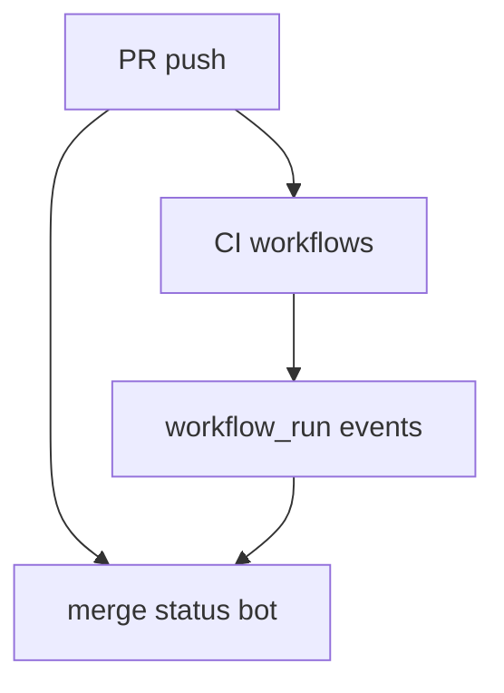

# Migrating from `beautiful-mermaid`

`zombie-mermaid` is a maintained fork of [`beautiful-mermaid`](https://github.com/lukilabs/beautiful-mermaid) — see the [README](../README.md#why-this-fork-exists) for why the fork exists. For the public API, this is a drop-in replacement: swap the package name and nothing else needs to change.

But "drop-in" is about the API, not the pixels. Part of what this fork does is fix Mermaid syntax that `beautiful-mermaid` parsed incorrectly or silently mishandled. If you already have diagrams in production — stored source rendered on the fly, or SVGs generated once and cached — some of them may render differently the moment you upgrade. Nothing here is a bug in the new behavior; each fix below makes the output match what Mermaid itself, and the diagram author, actually intended. But a silent visual change is still worth knowing about before it shows up in a support ticket.

This page covers what's safe to assume unchanged, itemizes the fixes most likely to change existing rendered output, and gives you a cheap way to check your own diagrams before upgrading.

## What is drop-in

- `renderMermaidSVG`, `renderMermaidSVGAsync`, `renderMermaidASCII`, and `parseMermaid` all have the same signatures as in `beautiful-mermaid`.
- `RenderOptions` and `AsciiRenderOptions` — colors, fonts, spacing, theming — work the same way. See [api-reference.md](api-reference.md).
- `mergeEdges` is new to this fork's `RenderOptions` — `beautiful-mermaid` has no equivalent option, so there's no prior behavior it needs to match.
- Built-in themes, Shiki compatibility, and CSS-variable-driven live theme switching are unchanged.
- The CLI (`zombie-mermaid` binary) is new to this fork — `beautiful-mermaid` never had one — so there's no prior behavior it needs to preserve.

If your code only calls these functions with diagram source and a `RenderOptions` object, no code changes are required beyond the import/package name.

## Output-affecting fixes

Each of these changes what gets drawn for Mermaid syntax that previously parsed into something else — not new syntax support for things `beautiful-mermaid` simply didn't have. If none of the trigger syntax below appears in your stored diagrams, none of this applies to you; the audit recipe in the next section tells you for certain either way.

### `classDef` / `class` styling

This is the fix most likely to affect a real diagram, because `classDef`/`class` is common Mermaid syntax and `beautiful-mermaid`'s support for it had several sharp edges. Most of these shipped together in this fork's [v1.2.0](https://github.com/dfadler/zombie-mermaid/releases/tag/v1.2.0) release; the last one (`classDef default`) needs [v1.3.0](https://github.com/dfadler/zombie-mermaid/releases/tag/v1.3.0):

- **A trailing semicolon on a `class` statement produced a stray node.** `class B highlight;` — completely valid, optional Mermaid syntax — fell through class-assignment parsing (which required unterminated `\w+$`) into node parsing, so instead of styling node `B` the diagram grew an extra node literally labeled `class`. Fixed in [#53](https://github.com/dfadler/zombie-mermaid/pull/53).
- **`:::className` before the shape brackets dropped the node's label entirely.** `A:::external[External User]` matched none of the shape-detection regexes (they require the id immediately before its brackets), so it fell back to a bare-id match and `[External User]` was discarded. Fixed in [#77](https://github.com/dfadler/zombie-mermaid/pull/77).
- **Custom classes never appeared as a `class` attribute on the SVG element**, even though the class's `fill`/`stroke` were already applied inline — so any external CSS meant to target `.highlight` had nothing to select. Fixed in [#75](https://github.com/dfadler/zombie-mermaid/pull/75).
- **Text on a custom-fill node could render unreadable.** A node styled via `classDef`/`class`/`style` with a `fill` but no explicit `color` always fell back to the ambient theme text color — white-on-light or black-on-dark, depending on the fill and the active theme. `src/renderer.ts` now computes a readable black/white text color from the fill's own luminance whenever the fill resolves to a concrete color (via `getReadableTextColor` in `src/theme.ts`), only falling back to the theme color when the fill is a CSS variable or otherwise unresolvable. Fixed in [#76](https://github.com/dfadler/zombie-mermaid/pull/76).
- **`style A font-family:...` and `classDef`-supplied `font-family` were parsed but never rendered**, silently ignored in SVG output. Fixed in [#78](https://github.com/dfadler/zombie-mermaid/pull/78).
- **`classDef default` only applied to nodes that named it explicitly** (`class X default`), instead of styling every node the way Mermaid does it. Fixed in [#206](https://github.com/dfadler/zombie-mermaid/pull/206) (v1.3.0).

Parsing lives in `src/parser.ts` around `graph.classDefs`/`graph.classAssignments`; resolution into inline node styles is in `src/renderer.ts`.

**Triggered by:** any diagram using `classDef`, `class`, `:::className`, or `style` — especially one with a trailing semicolon on a `class` line, a `:::className` shorthand before the node's brackets, or a custom fill without an explicit text color.

### Brackets inside quoted labels, and no-space arrows

`A["/blog/[slug]"]` previously rendered as `"/blog/[slug` — the shape-delimiter matcher used a lazy `.+?` to find the closing `]`, so it stopped at the first `]` it found, including one inside the quoted string. Any label containing a literal `[` or `]` — file globs, route patterns, array-index notation — was silently truncated. Delimiter matching is now quote-aware, so a complete `"..."` span is treated as a unit.

The same fix ([#80](https://github.com/dfadler/zombie-mermaid/pull/80), landed in v1.2.0) also fixed `A-->B` (no space around the arrow): the bare-node-id pattern greedily consumed the arrow's leading dashes, producing a bogus node `A--` and dropping the edge entirely.

**Triggered by:** a quoted node/edge label containing `[`, `]`, `(`, `)`, `{`, or `}`; or a flowchart edge written with no space before the arrow (`A-->B` rather than `A --> B`).

### Semicolons as statement separators

`sequenceDiagram;A->>B: Hi` correctly routed to the sequence-diagram parser (header detection already split on newline or semicolon), but the parser itself then split the body on newlines only — so everything after the header was discarded and the diagram rendered empty. The same gap affected class, ER, and `xychart-beta` diagrams. Flowcharts failed differently: `flowchart TD;A-->B` threw `Invalid mermaid header` outright, even though semicolon-separated statements are valid, longstanding Mermaid syntax. Fixed in [#204](https://github.com/dfadler/zombie-mermaid/pull/204) (v1.3.0) with one shared statement-splitting helper used by every parser entry point.

**Triggered by:** any diagram (other than flowchart, which errored) using `;` instead of a newline to separate statements — most likely a single-line diagram.

### SVG start-arrow direction

`orient="auto-start-reverse"` already rotates a start-arrow marker 180° to point back out of its source node, but the marker's own polygon points were also pre-reversed — the two cancel out, so the arrowhead pointed into the line instead of away from it. Some SVG renderers (librsvg, Inkscape) treat the resulting degenerate polygon as invisible rather than backwards. Fixed in [#50](https://github.com/dfadler/zombie-mermaid/pull/50) (v1.2.0).

**Triggered by:** any bidirectional or start-pointing edge (e.g. `A <--> B`, `A <-- B`) rendered to SVG.

### Edge bundling drawn through unrelated nodes

`mergeEdges` (on by default) replaces separately routed fan-out/fan-in edges with a shared trunk plus straight branches. That substitution assumed a branch only ever spans the gap between adjacent layers; when a fan-out target is several layers down, the branch could be drawn straight through any node sitting in an intermediate layer:



Fixed in [#217](https://github.com/dfadler/zombie-mermaid/pull/217) (v1.3.0): a bundled branch is now checked against every node box before being adopted, falling back to the layout engine's own (obstacle-avoiding) routing when it would collide.

**Triggered by:** a flowchart or state diagram with `mergeEdges` enabled (the default) and a fan-out/fan-in shape where a bundled edge's target is more than one layer away from its shared trunk.

### ER diagram cardinality and direction

- **The left-side "zero or more" crow's-foot marker (`}o`, e.g. `TAG }o--|| PRODUCT`) was silently dropped.** Cardinality strings were normalized by sorting their characters, which conflated `}o` with the unrelated `{o`/`o{` pair and left it unmatched — the relationship rendered with no cardinality marker on that side at all. Fixed in [#51](https://github.com/dfadler/zombie-mermaid/pull/51) (v1.2.0), which also fixed the ASCII/Unicode renderer mirroring the same marker on the wrong side.
- **The `direction` directive (`direction TB`/`LR`/`BT`/`RL`) was parsed but never applied to layout.** Fixed as part of [#81](https://github.com/dfadler/zombie-mermaid/pull/81) (v1.2.0); a diagram that set `direction` expecting a particular axis, and got the old default instead, now actually lays out on the axis it specified.

**Triggered by:** an ER diagram using the `}o` cardinality marker on the left side of a relationship, or a `direction` directive.

### Nested subgraph direction and cross-boundary edges

A `direction` override on a nested subgraph was silently ignored, and an edge crossing a subgraph boundary either fell back to a naive Z-shaped path or failed to route cleanly. Fixed in [#93](https://github.com/dfadler/zombie-mermaid/pull/93) (v1.2.0) by decomposing a cross-boundary edge into one routed hop per boundary crossed.

**Triggered by:** a flowchart with nested subgraphs where an inner subgraph sets its own `direction`, or an edge that crosses one or more subgraph boundaries.

### ASCII/Unicode: wide-character box sizing

Box width and column reservation were computed with `.length` (UTF-16 code units), so a CJK, kana, hangul, fullwidth-form, or emoji character — which occupies two terminal columns — was sized as one. Labels, subgraph titles, and (separately, in class/ER diagrams' multi-compartment boxes) attribute/method lines all overflowed their own borders as a result. Fixed for flowchart/state labels and titles in [#94](https://github.com/dfadler/zombie-mermaid/pull/94), and for class/ER multi-compartment boxes in [#203](https://github.com/dfadler/zombie-mermaid/pull/203) (v1.2.0 and v1.3.0 respectively), via a shared display-width-aware measurement helper.

**Triggered by:** any diagram rendered with `renderMermaidASCII` containing CJK, kana, hangul, fullwidth, or emoji characters in a node label, edge label, subgraph title, or class/ER member.

### ASCII flowchart: dropped edges and literal tags

Three separate bugs in the ASCII/Unicode flowchart path, all fixed in [#91](https://github.com/dfadler/zombie-mermaid/pull/91) (v1.2.0):

- `--o`/`--x`/`o--`/`x--`/`o--o`/`x--x` edges weren't recognized by the arrow regex at all, silently dropping both the target node and the edge.
- An edge terminating at a subgraph id (rather than a member node) produced two disconnected phantom boxes instead of connecting to the subgraph's frame.
- Inline `<i>`/`<b>`/`<em>`/`<strong>` tags in labels rendered as literal text instead of being stripped (`<br/>` already worked).

**Triggered by:** an ASCII-rendered flowchart using `o`/`x` arrow endpoints, an edge that targets a subgraph id directly, or inline HTML formatting tags in a label.

## Auditing your own diagrams before upgrading

The cheapest way to know whether any of the above actually affects you is to render your stored diagrams through both versions and diff the output — not to read this list and guess. Install both packages side by side and compare:

```bash
mkdir mermaid-upgrade-audit && cd mermaid-upgrade-audit
npm init -y
npm install beautiful-mermaid zombie-mermaid tsx
```

```typescript
// audit.ts — render every .mmd file in a directory through both packages,
// across every rendering path (SVG, Unicode ASCII, plain ASCII), and report
// which combinations produce different output. Checking SVG alone would miss
// the ASCII-only fixes above (wide-character box sizing, dropped ASCII
// flowchart edges) — those never touch renderMermaidSVG at all.
//
// Usage: npx tsx audit.ts ./path/to/your/diagrams

import { readFileSync, readdirSync, writeFileSync } from 'node:fs'
import { join } from 'node:path'
import {
  renderMermaidSVG as renderSvgOld,
  renderMermaidASCII as renderAsciiOld,
} from 'beautiful-mermaid'
import {
  renderMermaidSVG as renderSvgNew,
  renderMermaidASCII as renderAsciiNew,
} from 'zombie-mermaid'

const dir = process.argv[2]
if (!dir) {
  console.error('Usage: npx tsx audit.ts <directory-of-.mmd-files>')
  process.exit(1)
}

// One entry per rendering path worth auditing independently — a diagram can
// pass the SVG check while its ASCII output (Unicode or plain) still changes.
const channels = [
  {
    name: 'svg',
    ext: 'svg',
    render: (s: string, r: typeof renderSvgOld) => r(s),
  },
  {
    name: 'ascii-unicode',
    ext: 'txt',
    render: (s: string, r: typeof renderAsciiOld) => r(s, { useAscii: false }),
  },
  {
    name: 'ascii-plain',
    ext: 'txt',
    render: (s: string, r: typeof renderAsciiOld) => r(s, { useAscii: true }),
  },
] as const

const renderers = {
  svg: [renderSvgOld, renderSvgNew],
  'ascii-unicode': [renderAsciiOld, renderAsciiNew],
  'ascii-plain': [renderAsciiOld, renderAsciiNew],
} as const

const files = readdirSync(dir).filter((f) => f.endsWith('.mmd'))
let changed = 0

for (const file of files) {
  const source = readFileSync(join(dir, file), 'utf8')
  let fileChanged = false

  for (const channel of channels) {
    const [renderOld, renderNew] = renderers[channel.name]

    let before: string
    let after: string
    try {
      before = channel.render(source, renderOld as never)
    } catch (err) {
      // A render failure is itself a migration-relevant difference — e.g.
      // the old version throwing on syntax the new version now parses fine.
      // Count it as a finding rather than silently skipping past it, or a
      // diagram that's unsupported on one side could pass the audit clean.
      fileChanged = true
      console.log(
        `[ERROR on old, ${channel.name}] ${file}: ${(err as Error).message}`,
      )
      continue
    }
    try {
      after = channel.render(source, renderNew as never)
    } catch (err) {
      fileChanged = true
      console.log(
        `[ERROR on new, ${channel.name}]  ${file}: ${(err as Error).message}`,
      )
      continue
    }

    if (before !== after) {
      fileChanged = true
      console.log(`[CHANGED, ${channel.name}] ${file}`)
      // Write both out so you can diff them directly, e.g.:
      //   diff .audit-out/<file>.svg.before.svg .audit-out/<file>.svg.after.svg
      writeFileSync(
        `.audit-out/${file}.${channel.name}.before.${channel.ext}`,
        before,
      )
      writeFileSync(
        `.audit-out/${file}.${channel.name}.after.${channel.ext}`,
        after,
      )
    }
  }

  if (fileChanged) changed++
}

console.log(
  `\n${changed} of ${files.length} diagram(s) render differently after upgrading (across svg/ascii-unicode/ascii-plain).`,
)
```

```bash
mkdir -p .audit-out
npx tsx audit.ts ./path/to/your/diagrams
```

If your diagrams live in a database rather than `.mmd` files, swap the `readdirSync`/`readFileSync` loop for a query that yields `{ id, source }` pairs and key the audit output by `id` instead of filename — everything else stays the same. The point is that this whole check costs one script and a few minutes, so there's no reason to upgrade blind.

## Keeping the old (unstyled) look for one diagram

If a specific diagram now renders styled and you'd rather it didn't — say, it was relying on the old `classDef`/`class` breakage as an accidental "no styling" default — fix it at the diagram's own source: remove or adjust the offending `classDef`/`class` statements in that diagram's stored Mermaid text.

Resist the temptation to solve this with a render-time preprocessor instead (a regex or text pass that strips `classDef`/`class` statements before rendering, without touching the stored source). That makes the picture the user sees diverge from the diagram's own stored source, which breaks any "copy source" or "open in an external live editor" feature built against that source.
