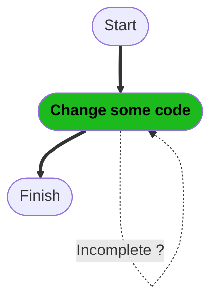
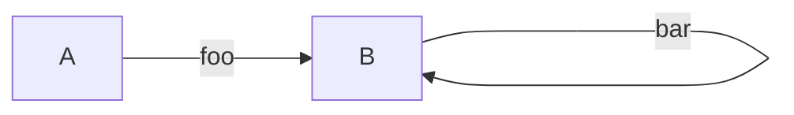

# Research: is Mermaid's self-loop rendering regression (mermaid-js#6049) still live?

Status: **research, not a decision.** Written for
[#537](https://github.com/dfadler/zombie-mermaid/issues/537), split from
[#536](https://github.com/dfadler/zombie-mermaid/issues/536). Compiled by
actually rendering the reproduction cases — not by reading the upstream
thread and assuming — as of 2026-09-08.

## TL;DR

- **The upstream dagre regression appears fixed in current Mermaid**, even
  though [mermaid-js/mermaid#6049](https://github.com/mermaid-js/mermaid/issues/6049)
  itself is still open. Rendering the issue's own flowchart repro and a
  state-diagram self-loop case with `@mermaid-js/mermaid-cli` (resolves
  Mermaid ~11.17.0, essentially current — npm's latest is 11.17.2, released
  2026-08-25) produces a smooth, rounded loop in both diagram types, not the
  angular/kinked shape the issue describes. This lines up with maintainer
  [knsv's 2026-06-09 comment](https://github.com/mermaid-js/mermaid/issues/6049#issuecomment-4660463086)
  that the DAGRE-pipeline refactor in
  [mermaid-js/mermaid#7812](https://github.com/mermaid-js/mermaid/pull/7812)
  ("Common Render pipeline 5: DAGRE shared paint," merged 2026-06-10) would
  fix this as a side effect — that PR shipped in Mermaid 11.16.0 (released
  2026-06-25), well before the current 11.17.2. The open state on #6049 looks
  like a maintainer housekeeping lag, not evidence the bug persists.
- **zombie-mermaid does NOT already render self-loops better — this is still
  an open opportunity.** zombie-mermaid's own SVG renderer (`pnpm exec tsx
src/cli.ts render ... --svg`, `mermaid` pinned to 11.17.2 in
  `package.json` for parsing only — the actual layout is zombie-mermaid's own
  ELK-based engine in `packages/svg-renderer/src/layout-engine/`) renders the
  same self-loop case as a tiny angular bracket sitting on top of the node
  (a straight-up, straight-across, straight-down path), not a rounded loop to
  the side. It is a plain 4-point polyline with no self-loop-specific curve
  logic — see Evidence below. This is a different shape from Mermaid's old
  "ugly" kink, but it's not "beautiful" either, and it's worse than what
  current Mermaid now produces for the identical input.

## Evidence

Repro used for the flowchart case (from mermaid-js/mermaid#6049 verbatim):



A second, simpler canonical case (from the elk-workaround comment on the same
upstream issue) was used to isolate the self-loop shape from an unrelated
zombie-mermaid parser quirk found while testing the first one (see Note
below):



Rendering the simple case with `@mermaid-js/mermaid-cli` (current Mermaid,
dagre layout) produces a smooth rounded loop to the right of node B — the
same clean shape the issue says existed before v11.1.1.

Rendering the identical `.mmd` file through zombie-mermaid's own CLI
(`render --svg`) produces this edge instead:

```
<polyline class="edge" data-from="B" data-to="B" data-style="solid"
  data-arrow-start="false" data-arrow-end="true" data-label="bar"
  points="242.9057,72.32 242.9057,62.32 262.9057,62.32 262.9057,72.32"
  fill="none" stroke="var(--_line)" stroke-width="1"
  marker-end="url(#arrowhead)" />
```

Four points, three right-angle turns, no curve — a small bracket balanced on
top of the node rather than a loop beside it. Confirmed visually (SVG
rasterized headlessly with `qlmanage -t`), not just read off the path data.

Grepping the layout code confirms there's no dedicated self-loop path: ELK's
own layout (`packages/svg-renderer/src/layout-engine/{to-elk,elk-graph-builder,
from-elk}.ts`) has no `self`/`selfLoop` handling at all, and the only
`edge.from === edge.to` special-casing in the whole repo lives in the ASCII
renderer (`src/ascii/edge-routing.ts`'s `selfReferenceDirection`, plus
sequence-diagram self-message handling in
`packages/svg-renderer/src/sequence/layout.ts` and `src/ascii/sequence.ts`).
The SVG flowchart/state-diagram path has nothing analogous — the self-loop
shape shown above is whatever ELK's generic edge router happens to produce
for a zero-length source/target pair, not an intentional design.

**Note (out of scope for this issue, flagged separately):** the first repro
above also exposed an unrelated zombie-mermaid parsing bug — the
`node\n    ==> next` continuation-line edge-chain syntax that Mermaid accepts
causes zombie-mermaid to drop the `finish` node and its edge entirely, and to
render the `green` node's label as its bare id (`green`) instead of its
bracket text (`Change some code`). This is a parser correctness bug
unrelated to self-loop rendering; it does not affect the conclusion above
since the second, simpler repro isolates the self-loop shape on its own and
parses correctly. Not fixed here — see the spawned follow-up task instead of
this PR.

## Conclusion

Answering the two questions #537 asked:

1. **Is the regression still reproducible in current Mermaid?** No — not for
   the two cases tested (flowchart and state-diagram self-loops). The
   dagre-pipeline refactor (#7812) that a maintainer said would fix it as a
   side effect shipped in Mermaid 11.16.0 and the self-loop now renders as a
   smooth loop in the current release (11.17.2).
2. **Does zombie-mermaid already render self-loops better?** No. This is
   still an open opportunity: zombie-mermaid's ELK-based SVG layout has no
   self-loop-specific routing at all, and produces a small angular bracket
   shape rather than a proper loop. A future issue should add explicit
   self-loop handling to `packages/svg-renderer/src/layout-engine/` (ELK
   itself doesn't lay out self-loops natively — it needs to be handled either
   before the graph reaches ELK or in the from-ELK edge-path reconstruction),
   mirroring the self-loop-aware routing that already exists for the ASCII
   renderer (`src/ascii/edge-routing.ts`) and for sequence-diagram
   self-messages.

## Sources

- https://github.com/mermaid-js/mermaid/issues/6049 (still open as of
  2026-09-08; last comment 2026-06-09)
- https://github.com/mermaid-js/mermaid/pull/7812 (merged 2026-06-10,
  shipped in Mermaid 11.16.0)
- https://github.com/mermaid-js/mermaid/issues/6336 (related, closed
  2026-05-08 as completed — predates #7812, so its closure isn't itself
  evidence of a fix; not relied on for the conclusion above)
- `@mermaid-js/mermaid-cli` (via `npx`), resolving Mermaid ~11.17.0, run
  locally against both repro cases
- `npm view mermaid versions/time` (current npm latest: 11.17.2, 2026-08-25)
- This repo's own `packages/svg-renderer/src/layout-engine/*.ts`,
  `src/ascii/edge-routing.ts`, `src/cli.ts render --svg`, run locally against
  the same repro cases
- https://github.com/dfadler/zombie-mermaid/issues/536
